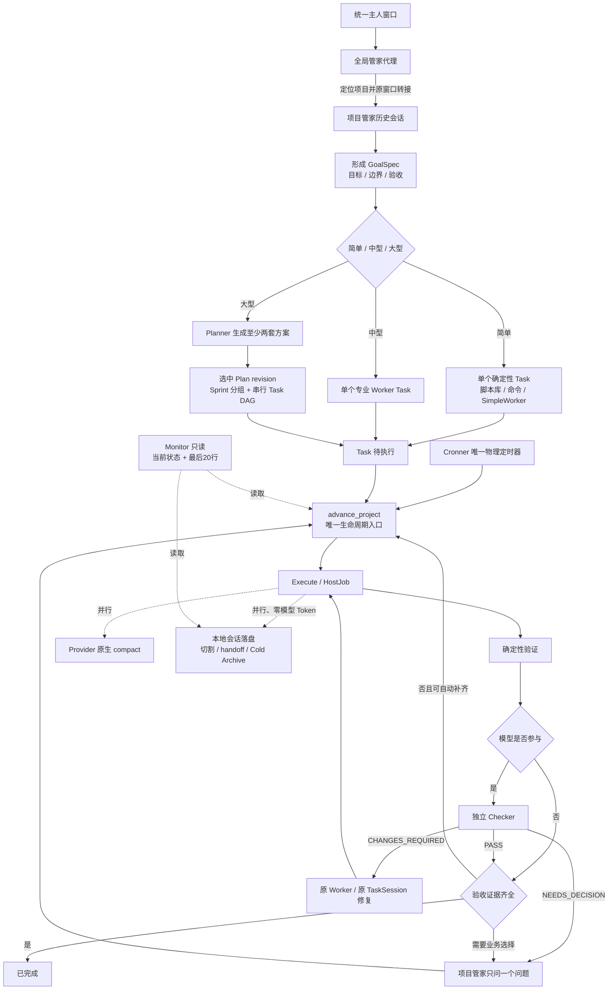

# PlowWhip 极简重设计基线 V1 · Revision 3

- 状态：**已冻结（FROZEN）**
- 冻结日期：2026-07-23
- 决策人：主人
- 当前 revision：**3**
- 适用范围：PlowWhip Web 控制面、Cronner、Monitor、Host Bridge、Provider、Worker、记忆与验证闭环
- 变更门禁：未经主人明确说“开始改”，不得据此修改代码、SQLite、Docker、任务、Provider 或蓝绿环境

Revision 2 主人决定：

- 保留独立的全局管家和项目管家入口。
- 新增 Token 导航与完整计量看板。
- 新增 Monitor 导航与独立只读看板。
- 项目页提供创建、进入和归档等基本操作。
- 持续维护需求/问题台账，记录人的要求、发现的问题、处理状态和验证证据；台账不是运行时状态真源。

Revision 3 主人决定：

- 在 Monitor 导航展示 Provider 的 0 Token 探针和极小 Token 探针；探针本身复用普通 Task、HostJob、Artifact、Evidence 和 ModelCallLedger，不新增状态表或第二推进器。
- Monitor 查询仍永远只读。点击探针只通过 `POST /api/messages` 提交 Probe Task；只有 Cronner 可以调用 `advance_project` 推进它。
- 0 Token 探针必须证明 `model_invoked=false` 且 Input/Cached-input/Output/Total 全为 0；不得用它证明最近真实执行健康。
- 极小 Token 探针不得周期执行，只允许显式二次确认后调用支持只读执行的 Provider；必须返回确定性标记，记录真实 Token，且单次 Total 不超过 4096。
- Task 页参考原任务页保留最有用的结构：项目 Task 列表、四态与 phase、等待原因、HostJob、TaskSession/Worker/Provider/generation、最后 20 行、Artifact/Evidence/handoff、立即唤醒、取消、重新执行和决定入口。

## 1. 使命

PlowWhip 的目标不是包装更多 Agent 概念，而是可靠完成主人交付的目标：

```text
主人用自然语言提出目标
→ 必要时由项目管家一次只问一个问题
→ 明确目标、边界、验收标准
→ 形成最小 Plan 和 Task DAG
→ 选择合适执行器
→ 自动执行、独立验证、修复并收敛
→ 只有真正需要主人决定时才打扰主人
```

设计原则：

1. 删除优先，YAGNI。
2. 复用现有确定性能力，不重复建设。
3. 最少状态、最少服务、最少文件、最少真源。
4. 不为现有 Bug 增加状态、补丁或特殊分支。
5. 工作区、Artifact、Evidence 和确定性验证是完成依据；模型自述、心跳和队列状态不是。
6. 主人的目标、边界和验收标准是产品真相；任何 Agent 不得擅自扩大范围。

## 2. 最终部署边界

```text
一个 PlowWhip Web Docker Image
├── Web / API / UI
├── 应用内置唯一 Cronner
├── Monitor
├── Butler / Planner
├── Lifecycle / Execution / Verification / Continuity
└── SQLite + 文件持久卷
            │
            ▼
一个宿主机 Host Bridge
├── 启动 Codex / Cursor 等本地 CLI
├── 管理真实进程、PID、退出码
├── 访问宿主工作区和本地会话文件
├── 管理 stdout/stderr 分段输出
└── 适配 macOS / Linux
```

边界：

- Cronner 是 PlowWhip 应用内置计时循环，不依赖操作系统 `crontab`、`launchd` 或 `systemd`。
- Monitor 等模块与 Web 一起打包在同一个镜像中，不是独立网络服务。
- 只有 Host Bridge 需要关注宿主操作系统。
- macOS 可用 `launchd`、Linux 可用 `systemd` 保证 Host Bridge 常驻；这不是 Cronner 的计时来源。
- 任意时刻只能有一个镜像实例获得生产调度租约。

## 3. 最终生命周期



完整闭环必须能够压缩为：

```text
Intake → Plan → Execute → Verify → Done / NeedsDecision
```

## 4. 状态模型

### 4.1 用户只看四个活动状态

| 状态 | 含义 |
|---|---|
| 待执行 | 已接受，但依赖、时间或项目执行槽尚未满足 |
| 进行中 | 系统仍负责自动推进，包括执行、检查、修复、重试和恢复 |
| 已完成 | 所有验收证据齐全；模型任务已获得独立 Checker PASS |
| 需要决定 | 缺少真实业务选择、授权、凭据，或自动路径已经耗尽 |

`cancelled` 是历史结果，不是第五个活动状态：

- 取消时停止 HostJob，尽力写入 handoff，归档当前 Session Generation。
- 取消不删除 Task、工作区、日志、Evidence 和 Artifact。
- 主人可以重新执行已取消 Task，继续使用原 `task_id`，但必须创建新的 Session Generation。
- TaskSpec 改变时 `spec_revision + 1`，旧证据不能自动证明新 revision。
- 已完成 Task 不重新打开；需要再次执行时创建新 Task。

### 4.2 内部字段正交化

```text
public_status
phase
wait_reason
fault_code
retry_count
next_retry_at
outcome
```

`plan`、`execute`、`check`、`repair`、`retry_wait`、`provider_recovery`、`stopping` 等是 `phase`，不是用户状态。

删除主状态：

- `verifying`
- `candidate_ready`
- `network_suspended`
- `provider_suspended`
- `terminal_failed`
- `stopping`
- `paused`
- `zero_progress`

## 5. 唯一生命周期所有者

所有 Goal/Task 流转只能经过：

```text
advance_project(project_id)
```

其他模块只能提交事实或调用该入口：

- Cronner：唤醒、租约、调用。
- API/Butler：提交指令、授权和决定。
- Worker/HostJob：提交执行事实、输出和 Artifact。
- Checker：提交验证结论。
- Provider：提交可用性和调用事实。
- Recovery：提交对账结果。
- Monitor：永远只读。

一次事务只做一个明确推进动作并记录结果。不同项目可以并行；同一项目严格串行。

## 6. Project、Goal、Plan、Sprint、Task

真正有业务含义的层级：

```text
Project
└── Goal
    └── Task
```

- Project：长期项目容器、工作区、规则和历史目标。
- Goal：主人一次完整诉求，包含目标、边界、验收标准和 revision。
- Task：可以交给一个角色执行并由 Checker 独立验收的最小单元。
- Plan：Goal 的版本化方案，不拥有独立状态机。
- Sprint：一个周期内应完成的一组 Task，只做分组和展示，不拥有状态、Session、Worker 或重试。

Goal 状态由 Task 推导，不再维护第二套隐藏状态机。

每个项目严格保持：

```text
一个 active Goal
+ 一个 active Task
```

后续 Goal 排队；只有主人明确调整时才能插队。只读 Monitor、搜索、日志查看不占执行槽。

## 7. 指令分类与 Planner

只保留三类：

### 简单任务

- 一个确定性动作可以完成并验证。
- 优先复用已验证脚本或直接命令。
- 不经过大型 Planner。

### 中型任务

- 一个专业 Worker 可以拥有完整责任。
- 使用一个 Task、一个执行角色 TaskSession 和一个 Checker TaskSession。
- 不创建 DAG 和大型 Planner 生命周期。

### 大型任务

满足任一条件即可判为大型：

- 多角色或多依赖步骤。
- 多 Sprint、长期持续作业或多层记忆。
- 必须比较不同方案。
- 涉及迁移、部署、不可逆动作或高风险。
- 一个 Worker 无法拥有完整责任。

Planner 必须：

- 生成至少两套真实可执行方案。
- 比较范围、成本、风险、可逆性和验收方式。
- 能依据验收标准客观选择且有至少 95% 把握时自动选择。
- 只有真正的业务取舍或信心不足时，才交给项目管家一次问一个问题。
- 选中的 Plan 必须预定义 Task 依赖、Sprint 分组、执行角色、Checker 角色、验证合同、调度策略和授权边界。

简单 → 中型 → 大型只允许单向升级，并记录原因；不把升级算作失败。

## 8. 管家与统一窗口

UI 保留两个清晰入口：

- 全局管家：跨项目检索、选择/定位项目、将消息路由到项目。
- 项目管家：只读取和写入当前项目消息历史，并一次只处理当前项目的一条主人指令。

### 8.1 项目内唯一对话出口

只有项目管家可以向主人提问。Planner、Worker、Checker、Provider 和 Recovery 只能提交结构化阻塞事实。

- 能从现状可靠推断的信息直接补齐，不机械要求主人填表。
- 一次只允许存在一个等待主人回答的问题。
- 项目管家提问保持自然，不强制每次使用僵硬选项。

### 8.2 全局管家是代理

统一窗口默认由全局管家接待：

```text
主人说“找 A 任务”
→ 全局管家查出 A 属于甲项目
→ 当前窗口不关闭
→ active_scope 切换为 project:甲
→ 加载甲项目管家历史 messages
→ 当前指令写入甲项目历史
```

全局历史只记录一条转接引用，不复制消息正文。

必须区分：

```text
统一 UI 窗口
≠ 管家逻辑消息历史
≠ Provider 物理 Session
```

项目管家历史长期保存在 SQLite `messages`；物理 Provider Session 可以按 Task 独立压缩、轮转和替换。

### 8.3 全局管家职责

- 跨项目搜索 Task、进度、Artifact、Evidence 和记忆索引。
- 将指令路由到正确项目。
- 处理明确的新项目入口。
- 精确查询先走 SQLite/文件索引，只有语义归纳才调用模型。
- 不直接控制项目 Task，不读取所有项目完整 Cold Archive，不复用某项目 Worker Session。

## 9. Worker、TaskSession、SessionGeneration、HostJob

最终关系：

```text
WorkerTemplate
    ↓
Worker：project_id + role_key 的长期逻辑岗位
    ↓
TaskSession：Task + 角色的稳定工作槽
    ↓
SessionGeneration：物理 Provider 会话
    ↓
HostJob：一次真实进程或调用
```

规则：

- TaskSession 必须按 Task+角色唯一，同一 Task 可以同时拥有执行角色和 Checker 角色 TaskSession。
- TaskSession 在 Task 生命周期内保持稳定。
- Provider Session 损坏或切换时，只增加 Session Generation。
- 新 Task 即使使用同一 Project+Role，也必须创建新 TaskSession 和新物理 Provider Session。
- HostJob 只记录一次真实执行，不拥有 Session。
- Worker 不保存 `external_session_id`、generation、HostJob 或独立运行状态真相。

删除对象：

- RoleInstance：能力并入 TaskSession 的冻结角色/规则快照。
- ProviderInstance：就是 SessionGeneration。
- SessionBinding：TaskSession 与 SessionGeneration 已表达完整所有权。
- Attempt、ExecutionEpisode、Run、Candidate：由 HostJob 序列、purpose、generation 和 spec_revision 表达。

HostJob 最小字段：

```text
task_id
task_session_id
session_generation
spec_revision
sequence
purpose: execute / check / repair / command
status
started_at
ended_at
returncode
output_ref
failure_code
```

## 10. Provider Pool

Provider 路由只使用角色/模板的有序候选列表，不建立动态评分、竞价或并行竞跑。

默认顺序：

```text
项目管家 / Planner：Codex CLI → Cursor CLI → DeepSeek → Kimi
常规 Fullstack Worker：Cursor CLI → Codex CLI → DeepSeek → Kimi
SimpleWorker：DeepSeek → Kimi → Codex CLI
```

Provider Pool 只管理 Adapter、模型能力、可用性事实和候选顺序，不拥有 Task、Worker、TaskSession 或完成判断权。

自动递补：

- HostJob 运行中不得切换。
- 安全边界归档旧 generation。
- 使用最新 handoff 创建 generation + 1。
- Task、TaskSession、TaskSpec、预算和已确认 Evidence 不重置。
- 普通故障自动递补；只有新凭据、数据边界、明显新增成本或全部候选不可用时才进入“需要决定”。
- 不为探活周期性调用付费模型。

Provider Adapter 的最小上下文能力：

```text
report_context_usage()
supports_native_compact
compact()
supports_resume
start_session()
```

## 11. 验证与自动收敛

完整回路：

```text
Execute
→ Deterministic Check
→ Independent Checker
    ├── PASS → 完成门槛
    ├── CHANGES_REQUIRED → 原 Worker 修复
    └── NEEDS_DECISION → 项目管家
```

- 纯非模型确定性任务可以只做确定性验证。
- 所有模型参与的产出必须经过独立 Checker。
- Checker 使用独立角色和 TaskSession，只读 TaskSpec、diff、Artifact、Evidence 和 handoff，不读取执行 Worker 的自由聊天。
- Checker 返回 `CHANGES_REQUIRED` 时必须提供 acceptance_id、实际证据、预期结果、允许修改范围和重验命令。
- 修复继续使用原 Task 和原执行 TaskSession，不创建 Verification Task 或 Candidate。

Task 完成门槛：

```text
所有确定性检查通过
+ 必要 Artifact 存在且哈希已记录
+ 模型任务独立 Checker PASS
+ 每个 acceptance_id 都有对应 Evidence
= 已完成
```

退出码、模型自述、文件变化、Token 消耗和 running/finished 标签都不能单独证明完成。

## 12. 故障、进展、恢复与超时

### 12.1 故障不是状态

最小 `fault_code`：

```text
transport
provider
process
verification
credential
unsafe_unknown
scope
```

可自动处理时 `public_status=进行中`，用 `phase` 表示 retry、repair 或 provider recovery。自动路径耗尽或需要安全/业务选择时才进入“需要决定”。不存在 `terminal_failed` 用户状态。

### 12.2 真实进展

只认：

- 工作区 revision 或有效文件哈希变化。
- 新 Artifact。
- Evidence 更新。
- acceptance_id 由未通过变为通过。
- 已确认 TaskSpec 步骤完成。
- 主人新的有效决定。

不认：心跳、日志增长、Token 消耗、Provider 自述或重复输出。

没有代码变化也不等于 zero progress；查询、分析和验证任务可以通过 Evidence 完成。

### 12.3 中断恢复

任何重试前必须 reconcile：

```text
读取 SQLite 当前状态
→ 检查 HostJob 和 Provider Session
→ 检查工作区、Artifact、Evidence、handoff
→ 必要时读取最后20行
→ 确认最后一个有证据的完成点
→ 再决定继续、恢复、换 generation、递补 Provider 或请求决定
```

不可逆操作是否执行不明时，禁止盲目重试。

### 12.4 超时

```text
max_runtime_seconds：单次 HostJob 最长运行时间
deadline_at：整个 Task 的计划截止时间，可空
stop_grace_seconds：超时后优雅停止宽限时间
```

- 600 秒保留为可覆盖的 Global fallback，不硬编码为所有任务的统一值。
- 大型 Plan 由 Planner 为每个 Task 明确设置 `max_runtime_seconds`。
- 简单/中型任务使用 WorkerTemplate、Project 或 Global 默认值。
- 生效优先级：Task+角色 > Project > Global。
- 超时后先 reconcile，保存输出/Evidence/handoff，再优雅停止；超时不直接判定 Task 失败。
- “长时间没有输出”不是超时判断依据。

## 13. Cronner 与逻辑闹钟

只有一个应用内 Cronner 物理计时循环。

Planner 在 Plan 确认时写入声明式调度策略：

- Task 依赖。
- 最早开始时间。
- 截止时间。
- 最大运行时间。
- 重试退避。
- 必要的验证/观察频率。
- 会话检查和 handoff 刷新要求。

Planner 不创建系统定时器、crontab 条目、Scheduler 进程或任意定时代码。

运行时优先使用：

```text
next_action_at
next_action_kind
```

Cronner 每次 Tick：

1. 查询已到期项目。
2. 获取项目租约。
3. reconcile 当前状态。
4. 调用 `advance_project(project_id)`。
5. 最多执行一个明确生命周期动作。
6. 检查会话文件和上下文阈值。
7. 计算下一次 `next_action_at` 并释放租约。

停机恢复后只处理当前到期事实，不逐秒补跑错过的 Tick。

## 14. Monitor 与有损观察

原则：

```text
保证任务连续性，不保证观察连续性。
有损观察，无损意图；有损过程采样，无损产物与验收事实。
```

允许丢失且不补录：

- Monitor 定时采样。
- 心跳历史。
- UI/SSE 推送。
- 页面缓存。
- 中间进度提示。
- 重复 Provider 快照。

必须持久化：

- 主人目标、边界、验收、决定和不可逆授权。
- TaskSpec revision。
- Task、TaskSession、Session Generation 和 HostJob 关键事实。
- Artifact、Evidence、Checker 结论和 handoff 引用。
- 已确认生命周期迁移。

Monitor 永远只读。恢复后读取当前 SQLite、workspace revision、Artifact/Evidence、最新 handoff 和最后 20 行，不回放全部日志。

Monitor 在 UI 中拥有独立导航和只读看板，至少显示：

- 控制面、SQLite WAL/完整性、Cronner 应用内唤醒事实。
- Project、Task 四态、到期动作、租约、TaskSession、HostJob、Artifact 统计。
- 最近 20 条必要生命周期事件。
- Provider 0 Token 探针事实和极小 Token 执行健康事实；两者必须分层显示。

Monitor 看板不得创建采样表、心跳历史、第二套状态或直接状态写入口。探针按钮只创建普通 Probe Task，不能由 Monitor 直接调用 Provider、写运行态或推进生命周期。

## 15. 三层记忆、会话落盘与 Token

### 15.1 两条机制长期并行

```text
轨道 A：Provider 原生 compact，管理模型当前上下文
轨道 B：PlowWhip 本地会话落盘、文件轮转、handoff 和 Cold Archive
```

Provider compact、本地文件切割和 handoff 更新互不替代。只有真正需要时才用最新 handoff 创建新的 Session Generation。

### 15.2 三层语义

- Hot：当前动作所需的最小 Context Capsule，临时生成，不保存 `current.md` 副本。
- Warm：每个 Task+角色的结构化 `current.json` handoff，是恢复入口。
- Cold：完整分段会话、日志、Artifact、Evidence、历史 handoff 和 Session 引用，默认不进入 Prompt。

handoff 只包含稳定 ID/revision、已确认完成项及 Evidence、当前未完成项、Checker 结论、阻塞、下一最小动作、Artifact 路径/哈希和主人最新决定。

不包含旧聊天、完整终端输出、模型思考、大段代码或原始工具日志。

### 15.3 Token 统计

`cached_input_tokens` 是 `input_tokens` 的子集，不能相加两次。

- Provider 返回单次用量时直接记录。
- Provider 返回 Session 累计快照时，保存原始快照并只计算同一物理 Session 相邻快照的差值。
- 更换 Session Generation 时创建新的累计基线。
- Task 总预算跨 compact、generation 替换和 Provider 递补持续累计。
- Checker 用量计入当前 Task，但按 Checker TaskSession 分开显示。
- 文件 stat、切割、哈希和确定性 handoff 是零模型 Token。
- Provider 原生 compact 如果上报用量，则正常计入。

Token 在 UI 中拥有独立导航和看板，固定使用 Asia/Shanghai 日界，至少显示：

- 全历史与今日的 Total、Input、Cached-input、Uncached-input、Output。
- 全历史与今日的 Input/Output、Cached-input/Uncached-input 可见比值；分母为零时显示无值。
- Token 日趋势和项目消费占比。
- 按项目、Task、model、TaskSession 的消费明细；Session 明细必须显示 `task_session_id` 及归属 Worker。

计量看板只解释 ModelCallLedger，不参与预算准入、调度、熔断、进展判断或质量终态。

## 16. SQLite 与消息队列

SQLite WAL 是唯一状态库和持久队列；不引入 Redis、RabbitMQ、Celery 或第二套 Task Queue。

最终权威记录限制为十五类：

```text
projects
messages
goals
plans
tasks
task_dependencies
workers
task_sessions
session_generations
host_jobs
artifacts
task_events
model_calls
library_items
settings
```

说明：

- `messages` 保存全局/项目管家对话、主人决定和结构化 action。
- `tasks` 本身就是执行队列：待执行、依赖满足、项目槽空闲即可领取。
- `task_events` 只保存必要生命周期里程碑，不保存 Monitor 采样。
- `artifacts` 索引 Artifact、Evidence、handoff 和日志文件路径/哈希。
- 项目租约优先放入 `projects`。
- 逻辑闹钟优先放入 `tasks.next_action_at`。
- 只有十五类记录无法表达已证明的真实需求时，才讨论新增表。

## 17. 文件目录

所有运行文件统一放在可配置 data root，不写进用户项目源码目录：

```text
data/
├── global/
│   └── conversations/
├── projects/
│   └── {project_id}/
│       ├── conversations/
│       └── tasks/
│           └── {task_id}/
│               ├── handoffs/
│               │   ├── executor/current.json
│               │   └── checker/current.json
│               ├── sessions/
│               │   ├── executor/generation-000001/
│               │   └── checker/generation-000001/
│               └── artifacts/
└── library/
    ├── roles/
    ├── rules/
    ├── worker-templates/
    └── scripts/
```

- 文件按 project → task → role → generation 组织。
- 文件轮转只增加新 segment，不覆盖旧 segment。
- `current.json` 原子替换，旧版本进入 archive。
- SQLite 保存路径、范围、SHA-256 和 revision。
- 浏览器只提交 Task ID，后端解析并验证合法路径，禁止任意本地路径读取。
- 不再生成第二套 `AGENT_STATE.json`、`CURRENT_STATUS.md`、`NEXT_ACTION.md` 或 `AGENT_COMMS.md` 运行时真源。
- Provider 自有会话文件可以保留；PlowWhip 不修改它们，只管理自己捕获的会话事件、输出和 handoff。

## 18. 角色、规则、Worker 模板与脚本库

正文以文件为真源，SQLite `library_items` 保存索引、revision 和 SHA-256。TaskSession 创建时冻结本次实际使用快照。

### 18.1 规则合并

普通规则优先级：

```text
主人当前 Task 明确要求
> Project 规则
> Role 规则
> Global 默认规则
```

权限、安全、秘密、不可逆操作、工作区和 Checker 独立性属于硬约束，只能由主人针对具体 Task 明确授权。

### 18.2 Worker 模板

- Worker 第一次成功并通过 Checker 后，可以自动沉淀为项目范围模板。
- Task 临时调整只进入 TaskSession 快照。
- 主人明确说“以后都这样”时才更新项目模板 revision。
- 跨项目全局模板必须再次由主人确认。
- 模板不包含 Session、Task ID、临时授权、handoff、秘密或任务特例。

### 18.3 SimpleWorker 与脚本

执行顺序：

```text
已有已验证脚本
→ 确定性命令
→ 必要时才调用 SimpleWorker 生成脚本
```

新脚本只有在当前 Task 验收通过后才入库，默认项目范围，确认真正通用后登记为全局。

可复用脚本采用“单文件函数模块 + CLI”形式：

- 一个模块只负责一类确定性功能。
- 参数显式传入。
- 成功退出码 0，失败非零。
- stdout 返回结果，stderr 返回诊断。
- 机器消费时提供简洁 JSON。
- 优先标准库和系统命令。
- 只有出现真实共享需求时才继续提取公共模块。
- 不建立 BaseScript、ScriptFactory 或插件框架。

## 19. 配置

业务配置优先级：

```text
Task + 角色特例
> Project 配置
> Global 默认配置
```

适用内容：Provider 顺序、Context/compact/轮转阈值、handoff/checkpoint 上限、观察尾部、HostJob 超时、修复/重试次数和退避。

TaskSession 创建时计算有效值、显示来源并冻结。

环境变量只负责部署级配置：

- Web 地址和端口，默认 `127.0.0.1:8742`。
- SQLite/data root。
- Host Bridge 地址。
- API Key、Token 和 Secret 引用。
- 环境标识和 Cronner 生产租约资格。

业务阈值不散落到 Docker env；Secret 不进入 SQLite 或模板正文。

## 20. 主人页面和 API

页面保留七个导航入口：

1. 全局管家。
2. 项目管家。
3. 项目。
4. Task。
5. Token。
6. Monitor。
7. 设置与资源库。

Task 详情显示：

- 四态和内部 phase。
- Worker 角色、Provider、模型和 generation。
- 当前 HostJob 最后 20 行。
- 本地完整会话及历史分段文件。
- Checker 结论、acceptance、Artifact、Evidence 和 handoff。
- 取消、重新执行等明确操作。
- 同项目 Task 历史列表、等待决定的准确原因和立即唤醒；立即唤醒只提交 action，由 Cronner 在后续 Tick 推进。

Worker、Provider、Attempt、Episode、Candidate 不再各占产品页面，只作为 Task 诊断信息按需展开。

写入口收敛为：

```text
POST /api/messages：所有自然语言
POST /api/actions：有限确定性操作，包括 Task 操作及 Project 创建/归档
```

两者都只提交意图；只有 `advance_project` 推进状态。查询接口全部只读。外部 API 和 Agent 必须提供 idempotency key。

Provider 探针也使用上述入口：

```text
POST /api/messages
→ provider_probe Task
→ Cronner / advance_project
→ HostJob
→ Evidence
→ Done / NeedsDecision
```

项目不提供删除操作。归档项目只设置 `projects.archived_at` 并从日常项目列表和选择器隐藏；消息、Task、Artifact、Evidence 和目录全部保留。存在活动 Task 时拒绝归档；再次创建同一项目 ID 等价于恢复归档。

## 21. 权限与不可逆操作

只保留三档：

```text
只读
可恢复的范围内修改
不可逆或外部影响
```

- 只读自动执行。
- 工作区内可恢复修改按 Task 范围自动执行。
- 永久删除、破坏性迁移、部署切流、外部发送/发布/付款、权限变更、新付费 Provider 和超出工作区写入必须由主人明确授权。
- 默认删除改为移动到 `原文件名.rm.年月日时分秒`。
- 授权绑定 project、task、spec_revision、action_kind、target_scope 和有效期。
- 同一 Task/revision/动作范围在 Session 替换后可继续使用；不得扩散到其他 Task。
- Task 取消或完成后临时授权与临时 Secret 引用失效。

## 22. 代码模块边界

最终模块：

| 模块 | 唯一职责 |
|---|---|
| `intake` | 将 messages/actions 规范化为意图 |
| `butler` | 全局代理路由、项目对话、一次一个问题 |
| `planner` | 分类、方案、Task DAG、Sprint 分组、调度声明 |
| `lifecycle` | 唯一 `advance_project` |
| `execution` | TaskSession、SessionGeneration、HostJob |
| `verification` | 确定性验证、Checker、修复包 |
| `continuity` | Hot/Warm/Cold、handoff、文件轮转、恢复对账 |
| `cronner` | 唯一应用内计时入口 |
| `monitor` | 只读当前状态和最后 20 行 |
| `store` | SQLite 事务和文件引用 |

依赖方向：

```text
API/UI
  ↓
intake / butler
  ↓
planner
  ↓
lifecycle
  ├── execution
  ├── verification
  └── continuity
        ↓
       store

cronner → lifecycle
monitor → store（只读）
```

Planner、Checker、Monitor、Provider Pool 都是代码模块，不拆成网络微服务。

## 23. 当前环境对比基线

只读审计对象：

- 路径：`/Users/niugengtian/work/plow-whip-web_blue`
- 分支：`blue`
- HEAD：`0b06db7a14a23836c89e7e583d4512b19c62b30c`
- 审计时统计：36 个 migration 文件、68 次 `CREATE TABLE`、32 个 trigger、97 个 API 路由。

| 方面 | 当前环境 | V1 基线 |
|---|---|---|
| 自动化 | 已有 Scheduler、Recovery、Provider fallback | 保留能力，统一进入 `advance_project` |
| 状态 | 12 个 Task 状态 | 四个用户状态，其他降为正交字段 |
| 并发 | 默认 `max_parallel_workers=4` | 同项目一个执行槽，不同项目并行 |
| 验证 | VerificationEngine/EvidenceManifest + Verification Task/candidate | 保留验证能力，删除验证生命周期 |
| 会话 | `task_sessions`、`role_instances`、`session_bindings` 重叠 | TaskSession + SessionGeneration 单一所有权 |
| 记忆 | ContextCompiler、三层记忆、Codex compact 已部分实现 | 保留、统一语义并延伸到所有 Provider |
| 恢复 | Scheduler、Recovery、Resilience、Goal 多方推进 | 所有模块只提交事实，唯一 reducer 决策 |
| 观察 | 已有最后 20 行、有界输出、脱敏 | 直接复用到 Task 详情，Monitor 永远只读 |
| Butler | Planner 合同很强，但简单请求也容易进入复杂路径 | 简单/中型绕开大型 Planner |
| 规模 | XS/S/M/L/XL 和 sizing gates | 简单/中型/大型 |
| UI/API | 多对象、多状态、97 个路由 | 四个页面区域、messages/actions 两类写入口 |
| 超时 | 固定 600 秒倾向 | Planner/模板/项目/全局分层配置 |
| 失败 | zero_progress、terminal_failed、suspended 进入主状态 | reconcile；故障只记录 phase/fault |
| 数据 | 多代机制叠加 | 先逻辑收权，稳定后物理清理 |

### 23.1 必须保留和复用

- SQLite WAL、租约和 fencing 的正确能力。
- Host Bridge、真实退出码、分段 stdout/stderr。
- Provider Adapter 和有序 fallback 基础。
- ContextCompiler、Codex 原生 compact、SimpleWorker 三层记忆。
- 本地会话文件切割和零 Token handoff。
- VerificationEngine、EvidenceManifest 和 Artifact 哈希。
- 最后 20 行、有界字节、脱敏观察。
- ModelCallLedger 原始快照与归一化差值思想。

### 23.2 必须停止作为权威

- 多套状态推进器。
- Verification Task 和 `candidate_ready`。
- Attempt、ExecutionEpisode、Run、Candidate。
- RoleInstance、ProviderInstance、SessionBinding 的重复所有权。
- 同项目 `max_parallel_workers`。
- XS/S/M/L/XL 数值 sizing。
- Provider/网络故障主状态。
- `AGENT_COMMS.md`、`CURRENT_STATUS.md`、`NEXT_ACTION.md` 等并行运行时真源。
- Worker/Provider/Episode/Candidate 主产品页面和大量直接写状态 API。

## 24. 迁移与蓝绿门禁

“从 0 设计”不等于丢掉历史。迁移分两阶段：

### 第一阶段：逻辑收权

- 对现有 SQLite 做一致性备份。
- 新生命周期只认 V1 核心字段和 `advance_project`。
- 旧表和旧状态停止写入，但暂时只读保留。
- 旧“运行中”Task 必须 reconcile，不能机械映射。
- 无法证明仍在运行或已经完成的旧 Task 进入“需要决定”，禁止自动重跑。

### 第二阶段：物理清理

- 新闭环通过真实任务验收后再开始。
- 删除前扫描所有表/字段调用者。
- 列出历史保留、备份和回滚方案。
- 主人再次明确确认后，才物理删除表、字段、API、页面和旧推进代码。
- 禁止新旧状态机长期双写。

候选环境：

- 独立代码目录、Compose project、端口、SQLite 副本、data root 和 Host Bridge 测试命名空间。
- 候选镜像的 Cronner 默认关闭或不得取得生产租约。
- 使用 SQLite Backup API 或经过验证的一致性方式复制数据库，不单独复制主 `.db` 遗漏 WAL。
- 只有主人单独批准切换后，才停止现有 Cronner、释放租约、完成最终备份并启用候选 Cronner。
- 回滚前必须先停止候选 Cronner并确认租约释放。

## 25. 冻结规则

本文件是 PlowWhip 极简重设计的唯一 V1 基线。

1. 未经主人确认，不得新增状态、服务、表、队列、Session 所有者或并行运行时真源。
2. 任何新增设计必须先证明 V1 无法表达真实需求。
3. V1 变更必须记录主人决定并升级为新 revision。
4. 未收到主人明确“开始改”前，只允许分析、对比和制作改造清单。
5. 实施阶段必须保护当前未提交工作，不覆盖主人已有变更。

## 26. 需求与问题台账

仓库维护 `docs/PRODUCT_LEDGER.zh-CN.md`：

- 人的每项新增/变更要求单独编号，不把模型推断伪装成人的要求。
- 实施中发现的问题单独编号，写清影响、决定、状态和最小验证证据。
- 台账随实现同步更新；不复制完整日志、聊天或运行时状态。
- SQLite、Workspace、Artifact、Evidence 和确定性测试仍是运行时与完成证据，台账只负责产品决策连续性。
