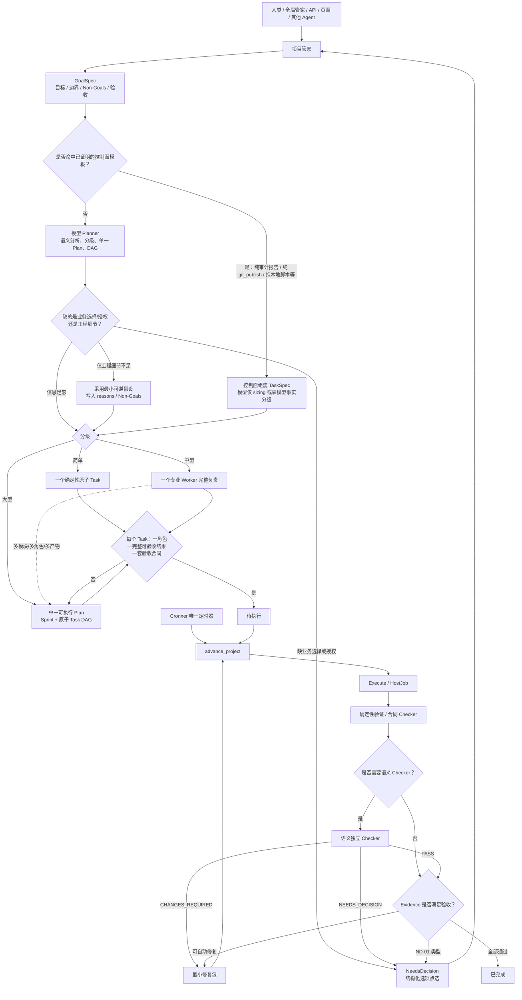
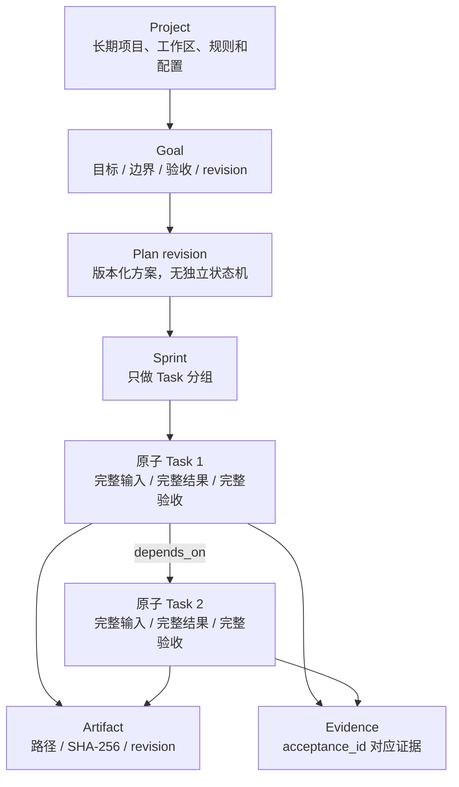
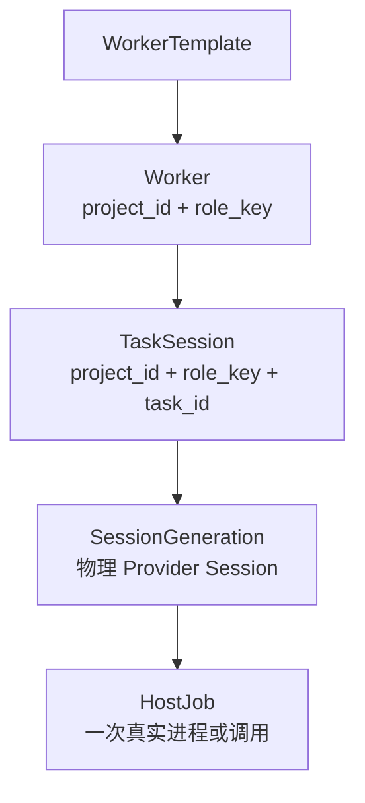
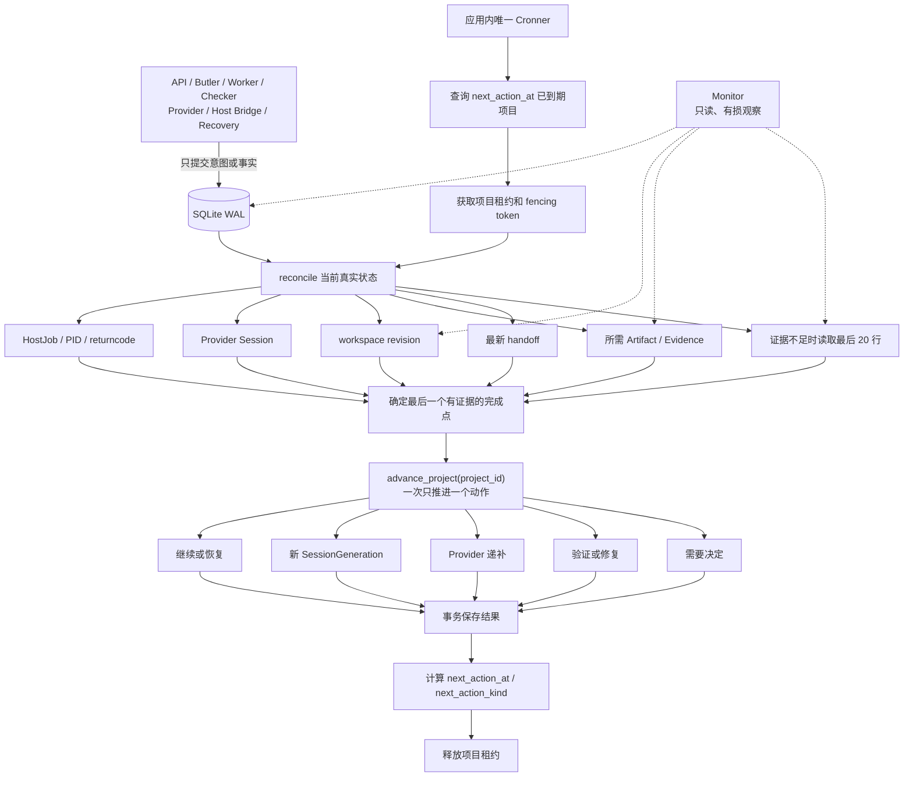
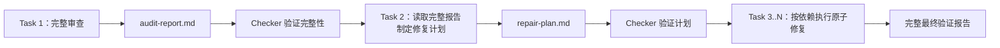
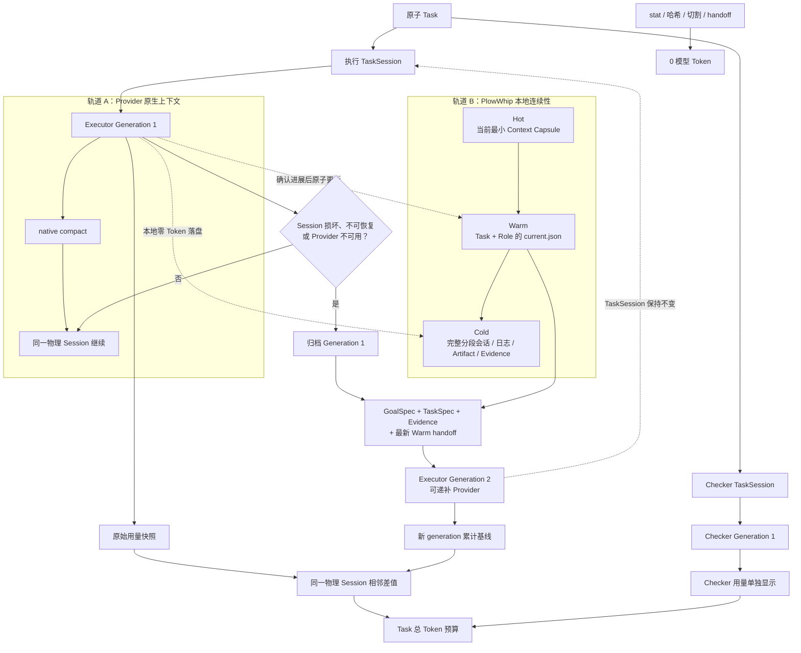
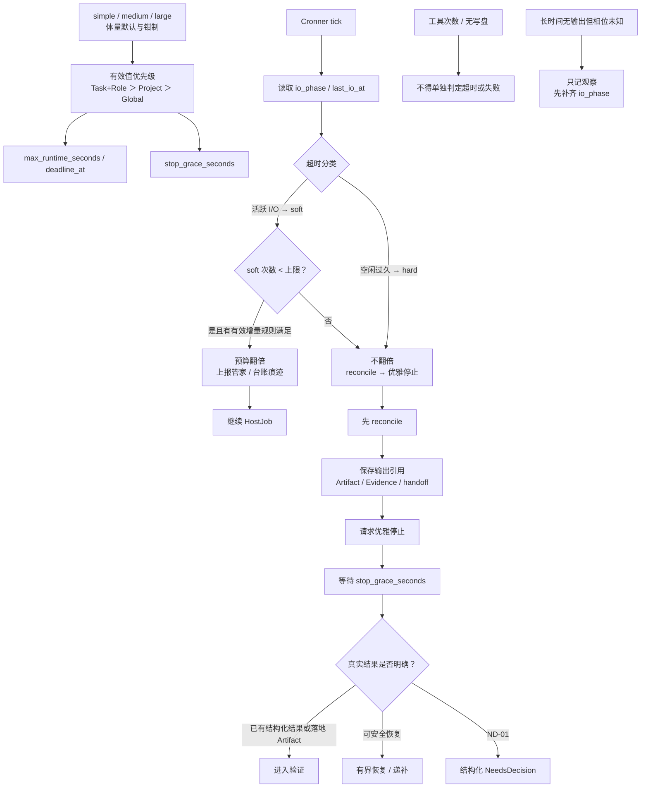
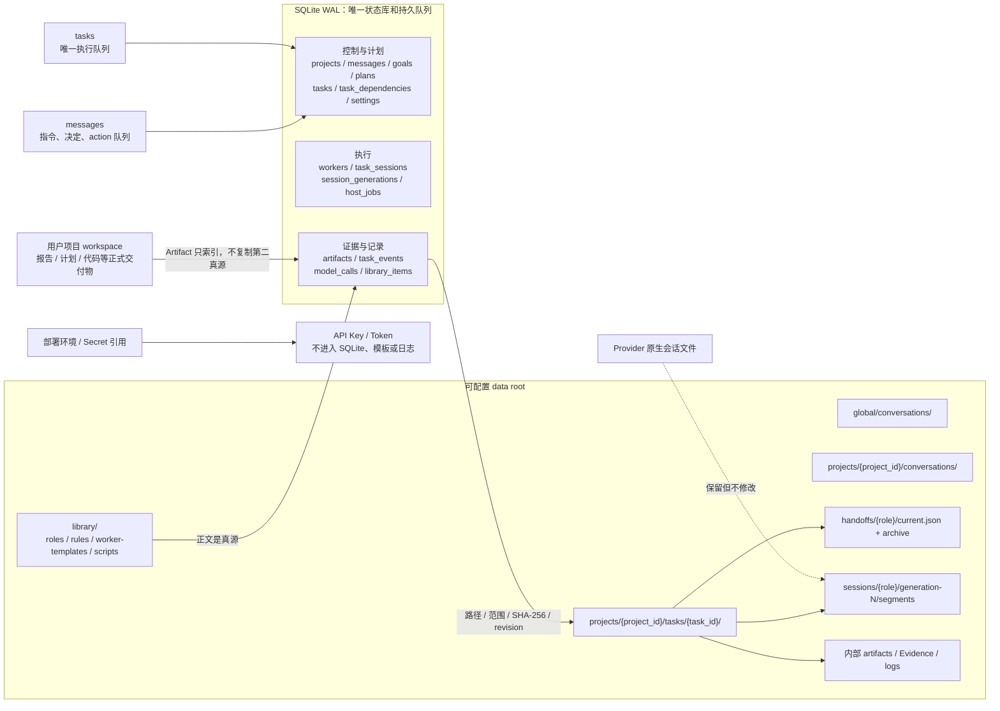

# PlowWhip Web 极简重设计审计基线 V3

> 状态：**已冻结**（主人确认：2026-07-26）  
> 用途：供对照审查 `/Users/niugengtian/work/plow-whip-web_blue-1` 的**唯一**设计基线  
> 前一版本：`/Users/niugengtian/work/plow-whip-web-v2/docs/MINIMAL_REDESIGN_BASELINE_V2.zh-CN.md`  
> 前一版本 SHA-256：`4ae79ba906997640304a202ba0d453e2437e77e36468c29eb4a185ad970f6098`  
> 原则：去伪存真、删除优先、YAGNI、最少状态、最少服务、最少文件、最少真源  
> 产品目标仲裁序：**正确证据完成 → 无人值守可达 → 极致省 Token**  
> 冻结后改正文必须升版（V4 或修订记录），不得静默改冻结稿；内容指纹以台账登记的 SHA-256 为准。

本文是实现符合性基线，不是现状说明。代码、测试或文档与本文冲突时，应报告冲突，不得用现状反向解释基线。自冻结起，**V2 不再作为审计基线**；未出现在本文的 V2 条款 ID 不作符合性依据。

### 冻结指纹

| 字段 | 值 |
|---|---|
| 冻结日 | 2026-07-26 |
| 确认语 | 主人：「先冻结V3」 |
| 文件 | `docs/MINIMAL_REDESIGN_BASELINE_V3.zh-CN.md` |
| SHA-256 | 见 `docs/BASELINE_V2_REMEDIATION_LEDGER.zh-CN.md`「唯一基线」条目（冻结瞬间 `shasum -a 256`） |

审计只认可：

- 实际代码调用链和写入边界。
- SQLite schema、约束和事务行为。
- 真实文件、Artifact、Evidence、哈希和 workspace revision。
- 可重复的确定性测试或最小运行证据。

审计不能仅凭 README、注释、测试名称、模型自述、队列状态或心跳判定“已实现”。

### V3 相对 V2 的主人裁定（变更摘要）

| 主题 | V2 立场 | V3 裁定 |
|---|---|---|
| 目标优先级 | 未写第三目标 | **G-01～G-03**：证据完成 > 无人值守 > 省 Token |
| Planner 权威 | 凡事模型 Planner 吐完整 Plan | **R1 / P-01'**：语义权威仍在 Planner；已证明模板 Goal 允许控制面组装 TaskSpec |
| 独立 Checker | 一律模型独立 Checker | **R2 / A-16'**：合同 Checker 与语义 Checker 分层；禁止标题冒充 PASS |
| NeedsDecision 范围 | ≥95% / 信息不足易打断 | **R3 / A-12'**：仅授权、凭据、不可逆副作用、真实业务二选一 |
| NeedsDecision 交互 | 常靠主人自由文本 | **ND-***：系统给出选项（理由/依据/利弊），主人只点选 |
| Plan A/B | 大型强制两套方案 | **废止 P-07/P-08**：大型直接产出单一可执行 Plan + DAG |
| 进行中/进展判断 | 易把「未写盘/工具次数」当失败 | **A-27～A-30**：角色感知 progress；exploration≠mutation |
| 超时 | 易一刀切杀掉仍在回复的模型 | **T-11～T-16**：I/O 相位；soft 续命有界；hard idle 不翻倍 |
| 空交付「继续」 | 同构重开大 HostJob 烧 Token | **A-31 / ND-05**：缺 Artifact+无进度 → 禁止同构继续 |
| 恢复硬顶 | 事件总数或无签名 | **A-32**：failure-signature 作用域，默认硬顶 5 |
| 结果判定 | 唯 exit code / 唯 stdout 形 | **R-18～R-20**：结构化结果与落地 Artifact 优先 |
| Bridge 瞬断 | poll unavailable / health 501 假象 | **A-34**：有界重试 + 可读阻塞事实，不假跑空转 |
| 取消收敛 | 长期 stopping 占槽 | **A-35**：stop_grace 内收敛 cancelled |
| UI 误导授权 | plan 失败也显示「15 分钟授权」 | **B-23**：仅真正 awaiting authorization 才显示授权 UI |
| Token 累计回落 | cumulative 回落崩 Cronner | **M-18**：回落钳制为 0 增量，不得崩溃 |
| 隐性降质旁路 | 现场 salvage/章节 override | **明确禁止**用「有章节/跳过 Checker」换完成率 |
| 简单任务脚本 | 模型当 shell / 或只「有脚本再命令」 | **D-32～D-34**：库检索→复用→缺则单职责生成→拼接→本地 Runner→验收后门禁入库 |
| Provider 默认序 | Codex 为首 | **B-04'**：模型角色默认 `cursor_cli → deepseek`；Codex/Kimi 可启用但不进默认序 |
| Provider 管理 | 逗号分隔表单 | **B-27**：项目级启用/禁用/调序；只影响新 TaskSession |
| 导航页 | V2 四页把 Token/Monitor 塞设置 | **B-25/B-26**：Token/Monitor 独立主导航 |
| 沿用未粘贴 V2 | 「未改写则沿用 V2」 | **废止双基线**：未出现在本文的 V2 ID 不作审计依据 |

禁止的隐性冲突形态（曾出现于现场补丁与台账 LIVE/MECH，V3 起一律冲突）：

1. 控制面模板跳过一切验收，直接安装 Plan。  
2. 确定性「有章节」覆盖语义 Checker 已给出的结构化 scope/证据缺陷。  
3. 把「继续」或主人自由文本改写成完整 TaskSpec / objective。  
4. 同失败签名无界「继续」或跨 Provider 连烧以冲 Done。  
5. 把只读多文件探索判为 `no_progress` 并杀掉仍在模型回复中的 HostJob。  
6. 无体量区分的固定超时直接停；或仅因「工具次数」判定 Task 失败。  
7. 缺声明 Artifact / 空 formal manifest 后仍同构重开同等大 execute。  
8. 已有可解析 `PLOWWHIP_*` 或已落地 Artifact，仍因 exit≠0 判失败并进入恢复烧预算。  
9. Bridge 短暂不可用时无界空转或把 501 当成「功能未实现」误导。  
10. 取消后 HostJob 长期 `stopping`，占住项目唯一活动槽。  
11. 非授权类 NeedsDecision 仍展示「采用方案 / 15 分钟授权」文案或按钮。  
12. 需要本地脚本时让模型当任意 shell，或不经脚本库检索就生成等价模块。  
13. 以 Codex-first 默认序或未登记 adapter 冒充可用 Provider。  
14. 把 Token/Monitor 重新埋进设置页，或宣称「仅四产品页」。

## 0. 审计输出合同

插件必须逐条输出：

| 字段 | 要求 |
|---|---|
| 条款 | 本文条款 ID |
| 结论 | `已实现 / 部分实现 / 仅文档 / 未实现 / 与基线冲突` |
| 代码证据 | 精确文件和行号；必要时补充调用者 |
| 验证证据 | 测试、命令或可复现运行结果 |
| 差距 | 缺少、重复、越权或错误所有权 |
| 最小处理 | 优先删除，其次复用，最后才新增 |

审计全程只读：

- 不修改代码、数据库、Docker、任务或蓝绿环境。
- 不运行付费 Provider。
- 不部署，不切流，不跑无关全量测试。
- 先追踪真实主线，再判断；不得只按文件名推测。

## 0.1 产品目标与冲突仲裁

- **G-01 正确证据完成（不可牺牲）**：Done 只承认合同 + Artifact/Evidence（及分层 Checker PASS）。假 Done 比慢 Done 更贵。  
- **G-02 无人值守可达**：主路径可在无代决、无自由文本补丁下收敛；NeedsDecision 仅 ND-01 列举的类型。  
- **G-03 极致省 Token（最后）**：同失败不重烧；能确定性就不进模型；I/O 活跃与 Token 消耗都不是进展。  

冲突仲裁：

1. G-01 与 G-02 冲突时，保留证据硬度，收窄 NeedsDecision 与重试，而不是软化验收。  
2. G-02 与 G-03 冲突时，允许一次有界恢复，禁止同构重烧；优先控制面模板与合同 Checker，而不是再开大模型重审。**合同 Checker 优先不得覆盖语义 Checker 已给出的结构化否决**（见 A-16a）。  
3. 任何「为省 Token 或冲完成率」而删除独立验收、或用叙事代替 Artifact 的路径，均为与基线冲突。  
4. G-03 的「能确定性就不进模型」包含：脚本库命中复用、合同 Checker、控制面模板；**不包含**用章节标题或空叙述冲 Done。

---

## 一、核心生命周期与 Planner

### 1.1 最终主线



完整闭环必须能压缩为：

```text
Intake → Planner（模型与/或控制面模板）→ Plan → Execute → Verify → Done / NeedsDecision
```

NeedsDecision 出口必须是：**结构化选项点选 → messages/actions**，不得要求主人撰写可执行 TaskSpec 或 Plan JSON。

### 1.2 Planner 硬规则

- **P-01（修订）**：所有正式自然语言指令必须先进入 Planner 路径做语义分析与任务分级。Planner 路径包含：  
  - **模型 Planner**：理解意图、工作量、风险与依赖，并产出单一 Plan；或  
  - **控制面模板路径（R1）**：当且仅当 Goal 命中已登记、已证明的模板族（至少包括：纯审计/报告交付、纯确定性 `git_publish`、纯本地脚本库执行）时，允许模型只做 sizing（或在事实已充分时由控制面确定性分级），由控制面组装 TaskSpec。  
  控制面组装结果**不得跳过合同验收**（见 A-16'）；不得把未登记模板扩大为通用「跳过 Planner」。
- **P-02**：关键词、正则、步骤数量等只能作为 Planner 输入事实，不能单独成为最终分级权威；控制面模板命中必须由显式模板登记表 + Goal 约束共同证明，而非关键词碰巧匹配。
- **P-03**：Planner 只分简单、中型、大型三类；不得恢复 XS/S/M/L/XL 等多套分级。
- **P-04（修订）**：简单任务是一个确定性动作即可完整交付和验证的任务。需要本地脚本能力时，必须走 **D-32 脚本模块管线**（库检索→复用/生成→拼接→本地 Runner），**禁止**把模型 Provider 当成任意 shell；也禁止跳过库检索直接生成等价模块。
- **P-05**：中型任务只能由一个专业 Worker 对一个完整责任边界负责。
- **P-06**：出现多个独立模块、角色、产物、依赖步骤、多 Sprint、迁移、部署或高风险时，必须升级为大型。
- **P-07（废止）**：~~大型任务必须生成 Plan A/B。~~ **废止。** 不得再要求、生成或展示强制双方案。
- **P-08（废止）**：~~Plan A/B 比较义务。~~ **废止。** 大型 Plan 的取舍理由写入 `classification.reasons` / `plan.rationale` 即可，不为此再烧一套并行方案；不得保留「选 A/B」语义字段要求。
- **P-09（修订）**：大型 Plan 默认由控制面自动安装为**单一选定 Plan**。仅当存在 ND-01 所列真实业务取舍或授权时，才进入 NeedsDecision；不得再以「置信度 < 95%」或「未给出 A/B」为由打断无人值守。
- **P-10**：大型 Plan 必须拆成有依赖关系的原子 Task；不得把多个模块塞进一个 Task。
- **P-11（修订）**：每个 Task 必须预定义责任角色、完整可验收结果、必要输入、验收合同、Checker 映射、依赖、超时和授权边界；只有交付型任务才强制 Artifact 文件。合同字段分两层：  
  - **控制面必填**：coverage、acceptance id、result 类型与路径（若 artifact）、depends_on、role、授权边界；  
  - **Provider 可 coerce 别名**：在不改变语义的前提下，允许有界别名归一（如 `expected_result`→`expected`、箭头 upgrade_path、描述性 path list→`owner_instruction`）。coerce 必须留下结构化痕迹，不得静默丢弃覆盖或验收。
- **P-12**：简单 → 中型 → 大型只允许有依据地升级，升级不是失败。
- **P-13**：Planner 负责语义分析、规划和无法确定的修复/异常决策；它不直接拥有 Task 状态机。
- **P-14**：Planner、Worker、Checker 和 Provider 不直接向主人提问，只向项目管家提交结构化阻塞事实。
- **P-15**：一次只允许存在一个等待主人回答的问题。
- **P-16（新增）**：Planner 必须遵守有界产品纪律：先钉问题/边界/Non-Goals；每个 Task 可验证 acceptance；范围蔓延写入结构化 reasons（接受/延后/拒绝）；取舍公开；完成=Artifact/Evidence 合同而非叙事；优先复用脚本库与既有路径。
- **P-17（新增）**：工程细节不足时，采用最小可逆假设并写入 `reasons`/`Non-Goals` 后继续；不得把「空 sandbox 无项目文件」或可稍后由 Worker 读取的路径缺失，当成必须询问主人的信息不足。

### 1.3 NeedsDecision 结构化点选（新增）

- **ND-01**：仅下列类型可进入 NeedsDecision：  
  1) 真实授权（不可逆/外部副作用/工作区外写入等）；  
  2) 新凭据或秘密引用；  
  3) 不可逆结果不明且无法安全 reconcile；  
  4) 真实业务二选一（目标/边界/验收本身互斥）；  
  5) 自动恢复按 failure-signature 耗尽且机制卡点已暴露。  
  工程猜测、字段别名、Provider 瞬时故障、空 sandbox、缺完美 JSON 形状等**不得**单独构成 NeedsDecision。
- **ND-02**：进入 NeedsDecision 时，系统必须生成 `decision_options`（至少 2 项，至多 7 项）。每一项必须包含：  
  - `option_id`（稳定、可点选）；  
  - `title`（短标签）；  
  - `reason`（为什么出现该选项）；  
  - `basis`（依据：Evidence/Artifact/Event/HostJob 引用或冻结事实）；  
  - `pros` / `cons`（利弊各至少一条）；  
  - `effect`（选中后系统将执行的确定性动作，如 authorize / cancel / install_plan / retry_checker，禁止「由主人重写指令」）。
- **ND-03**：主人只通过选择 `option_id`（或等价 UI 按钮/action）作答；**禁止**把主人自由文本解释为完整 TaskSpec、Plan JSON 或 objective 替换。自由文本仅允许作为已被选项声明的有界字段补丁（例如「在选项 force_with_lease 下粘贴远端 SHA」），且必须通过该选项的 schema 校验。
- **ND-04**：UI/Butler 必须完整展示当前问题的理由、依据与各选项利弊；在 `decision_options` 不完整时，不得启用通用输入框要求主人「随便写点什么继续」。
- **ND-05**：选项动作不得绕过授权绑定、Artifact 合同或恢复硬顶；选中「继续同构重试」类选项时，仍受同失败签名硬顶与空交付禁令约束。

### 1.4 Planner 与生命周期所有权

- **L-01**：所有 Goal/Task 状态推进只能经过 `advance_project(project_id)`。
- **L-02**：一次事务最多完成一个明确生命周期动作。
- **L-03**：API、Butler、Worker、Checker、Provider、Recovery、Cronner checkpoint 失败路径只提交意图或事实；不得另开生命周期写作用域直接改 Goal/Task 状态。
- **L-04**：Monitor 永远只读。
- **L-05**：同一项目严格保持一个 active Goal 和一个 active Task；不同项目可以并行。
- **L-06**：Goal 状态从 Task 推导，不维护第二套 Goal 状态机。
- **L-07（新增）**：Goal 显示 Done，当且仅当当前 Plan revision 下所有 required Task 的 `outcome=done` 且 Goal 级 required Evidence/覆盖已满足；`cancelled` 不得聚合为 Goal 完成。

---

## 二、最终核心对象

### 2.1 业务对象



```text
Project
└── Goal
    ├── Plan revision
    ├── Sprint 分组
    └── Task DAG
```

- **O-01 Project**：长期项目容器，保存工作区、项目规则、配置和历史 Goal。
- **O-02 Goal**：主人一次完整诉求，包含目标、边界、验收标准和 revision。
- **O-03 Plan**：Goal 的版本化方案，不拥有独立状态机。
- **O-04 Sprint**：一个周期内的一组 Task，只负责分组和展示，不拥有状态、Session、Worker 或重试。
- **O-05 Task**：一个角色可以完整交付、Checker 可以独立验收、失败后可以独立重试的最小责任单元。

“原子 Task”不等于碎片：

```text
小责任边界
+ 完整输入
+ 完整可验收结果
+ 完整验收
= 原子 Task
```

### 2.2 执行对象



- **O-06 WorkerTemplate**：角色、规则、Provider 顺序、能力和默认阈值的模板。
- **O-07 Worker**：Project+Role 的长期逻辑岗位，不保存物理 Session 或运行状态真相。
- **O-08 TaskSession**：Task+Role 的稳定工作槽；执行角色和 Checker 各自拥有独立 TaskSession。
- **O-09 SessionGeneration**：一次物理 Provider Session；Provider 切换或 Session 替换时 generation + 1。
- **O-10 HostJob**：一次真实进程或调用，只记录真实执行，不拥有 Session。
- **O-11**：物理 Provider Session 只能在 `project_id + role_id + task_id` 全部相同时复用。
- **O-12**：新 Task 必须新建 TaskSession 和物理 Provider Session，即使 Project+Role 相同。
- **O-13**：Session 损坏、无证据进展或 Provider 递补时，Task、TaskSpec、TaskSession 和已确认 Evidence 不重置。

HostJob 最小事实：

```text
task_id
task_session_id
session_generation
spec_revision
sequence
purpose: execute / check / repair / command
status
started_at
ended_at
returncode
output_ref
failure_code
```

### 2.3 必须删除的重复对象

- **O-14**：不得恢复 Attempt、ExecutionEpisode、Run、Candidate。
- **O-15**：不得恢复 RoleInstance、ProviderInstance、SessionBinding。
- **O-16**：不得为验证新建 Verification Task 或 `candidate_ready` 生命周期。
- **O-17**：HostJob 序列、purpose、generation 和 spec_revision 已足够表达真实执行历史。

### 2.4 状态

用户只看四个活动状态：

```text
待执行
进行中
已完成
需要决定
```

- **S-01**：`cancelled` 是历史 outcome，不是第五个活动状态。
- **S-02**：`plan / execute / check / repair / retry_wait / provider_recovery / stopping` 是内部 phase。
- **S-03**：`transport / provider / process / verification / credential / unsafe_unknown / scope` 是 fault_code，不是状态。
- **S-04**：不得恢复 `verifying`、`candidate_ready`、`terminal_failed`、`zero_progress`、`paused` 或各种 suspended 主状态。
- **S-05**：取消不删除 Task、workspace、Artifact、Evidence、日志或 handoff。
- **S-06**：重新执行已取消 Task 保留 task_id，但创建新的 SessionGeneration；TaskSpec 改变时 spec_revision + 1。
- **S-07（新增）**：公开状态为「需要决定」时，Monitor/Task UI 必须能读取完整 `decision_options`（ND-02）；缺少完整选项时不得展示可提交的自由文本决定框。

---

## 三、自动机制与恢复



### 3.1 唯一 Cronner

- **A-01**：PlowWhip Web 镜像内只有一个应用内 Cronner 物理计时循环。
- **A-02**：Cronner 不依赖操作系统 crontab、launchd 或 systemd。
- **A-03**：Planner 只写声明式调度事实：依赖、最早开始时间、截止时间、最大运行时间、重试退避、验证/观察频率和 handoff 要求。
- **A-04**：Planner 不创建定时器进程、crontab 条目或任意调度代码。
- **A-05**：运行时优先使用 `next_action_at` 和 `next_action_kind`。

每次 Tick：

```text
查询到期项目
→ 获取项目租约和 fencing token
→ reconcile
→ advance_project(project_id)
→ 最多执行一个生命周期动作
→ 检查会话和 handoff 阈值
→ 计算 next_action_at
→ 释放租约
```

- **A-06**：停机恢复后只处理当前到期事实，不逐秒补跑错过的 Tick。
- **A-07**：生产环境任意时刻只有一个镜像实例获得生产调度租约。

### 3.2 真实进展与进行中判断

**完成态只认（Done / acceptance 进展）：**

- workspace revision 或有效文件哈希变化（仅对 mutation 交付有意义）。
- 新的完整可验收结果：Artifact 或结构化 Evidence。
- Evidence 更新；acceptance_id 从未通过变为通过。
- TaskSpec 中一个确认步骤完成。
- 主人新的有效**点选**决定（ND-03）。

**进行中存活只认（不得因此判失败）：**

- 显式 I/O 相位仍活跃：`awaiting_model` / `model_response` / `tool` / `compacting`（及等价 Provider 事件）。
- exploration 模式下的有界独特读取、检索或分析前沿扩展（即使尚未写盘）。
- 有界 progress/heartbeat 事件（仅证明存活，不证明完成）。

**不认（不得当作完成，也不得单独当作失败）：**

- 心跳、日志增长、Token 消耗、running/finished 标签。
- Provider 或模型自述、重复输出。
- 「工具调用次数达到某固定值」本身（尤其不得用写盘阈值杀害 exploration）。

- **A-08**：查询、分析、探针、验证与纯审计报告 Task 可以在没有代码变化时，通过完整结构化 Evidence/报告 Artifact 证明完成。
- **A-09**：不得因为“没有代码变化”或“没有新日志”制造 zero_progress 用户状态或直接失败。
- **A-27（新增 / MECH-01）**：HostJob 必须携带角色感知 `progress_mode`：  
  - `exploration`：Planner、语义 Checker、只读分析、审计报告（允许多文件读，交付前可不写盘）；  
  - `mutation`：实现类写工作区 Task。  
  禁止把「workspace 写入」当作唯一进度定义套用到 exploration。
- **A-28（新增）**：exploration 的 tool-no-progress / max_turns 预算不得作为「仍在模型回复中」的杀刀；进行中失败归属墙钟超时与硬空闲策略（见 T-11～T-16），而非固定工具次数。
- **A-29（新增 / MECH-05）**：审计/报告交付 Task 必须声明 `progress_delivery=audit_report`（或等价），允许高回合探索后写出单一报告 Artifact；验收看报告合同，不看中间是否写过业务代码。
- **A-30（新增）**：Cronner/lifecycle 在 `execute_wait` / `plan_wait` / `check_wait` 期间必须维护或读取 `io_phase` 与 `last_io_at`（或等价 Bridge 事实），作为超时分类与管家可读状态的依据；不得只根据「距 start 已久」或「工具计数」判死。

### 3.3 中断恢复、同构重试与硬顶

任何重试前必须：

```text
读取 SQLite 当前状态
→ 对账 HostJob、PID、returncode 和 Provider Session
→ 检查 workspace、Artifact、Evidence 和最新 handoff
→ 解析结构化结果（stdout ∪ session ∪ 工作区回灌），不唯 exit code
→ 证据不足时读取最后 20 行（仅观察）
→ 计算 failure-signature
→ 决定续跑、新 generation、Provider 递补、结构化选项 NeedsDecision，或拒绝同构继续
```

- **A-10**：不可逆操作是否执行不明时禁止盲目重试。
- **A-11（修订）**：普通 Provider 故障在安全边界自动递补；递补前必须按 Provider **能力矩阵**过滤不可执行候选（模型传参、结果形状、read/write、progress 语义分厂商），禁止 DeepSeek/Kimi/Cursor 合同同质化后「先派发再失败」。
- **A-12（修订 / R3）**：进入“需要决定”的条件收窄为 ND-01；不再包含「置信度不足」「未给出 A/B」「工程细节可最小假设」等。入口必须满足 ND-02～ND-04。
- **A-13**：HostJob 运行中不得切换 Provider。
- **A-14**：恢复前必须归档旧 generation，并从最新有效 handoff 启动新 generation。
- **A-31（新增 / LIVE-DS-23）**：若当前 wait 表明**缺声明 Artifact 或 formal result manifest 为空**，且最近失败属于无进度/空交付类（如 `internal_tool_no_progress`、tool loop exceeded 等），则禁止同构「继续」/ `decision_retry` 重开同等 TaskSpec 的大 HostJob。合法出路只能是：结构化选项中的 cancel、缩 Goal、换策略/换模板，或已证明合同变更后的新 spec_revision。
- **A-32（新增 / MECH-07）**：恢复硬顶按 **failure-signature** 计数，而非模糊「同 Task 事件总数」。signature 至少包含：`spec_revision + phase + normalized failure_class/error_code + 声明结果身份（若有）`。默认同一 signature ≤ 5 次（含 provider_retry/fallback、planner/checker_retry、owner decision_retry）；第 6 次 fail-closed，`wait_reason` 必须暴露 blocking mechanism gap，并生成 ND-02 选项（禁止再提供「同构继续」）。有实质进展（新 Artifact/Evidence/acceptance 或新 spec_revision）时开启新 signature 桶。
- **A-33（新增 / MECH-04）**：Planner/Checker **解析或合同验证失败**必须先走有界递补或结构化重试；不得无差别把主人「继续」当成唯一出口，也不得把继续文案写成新 TaskSpec。
- **A-34（新增 / LIVE-P1-02）**：Host Bridge `poll`/`health` 不可用时：  
  1) 控制面必须区分「短暂不可达 / 明确未实现 / 任务不存在」；  
  2) 短暂不可达允许有界重试与强制 reconcile，并写入可读 `wait_reason`；  
  3) 禁止无截止空转（例如数十分钟假 running）；  
  4) health 不得用模糊 501 掩盖「Bridge 未配置/未启动」的真实阻塞事实。
- **A-35（新增 / LIVE-P2-01）**：取消路径必须在冻结的 `stop_grace_seconds` 内把相关 HostJob 收敛到终态，Task `outcome=cancelled`，并释放项目活动槽；不得长期停在 `stopping`。

### 3.4 验证与自动收敛

```text
Execute
→ Deterministic / Contract Check
→ Semantic Independent Checker（仅当合同 Checker 不足以证明验收时）
    ├── PASS
    ├── CHANGES_REQUIRED → 原 Worker 修复
    └── NEEDS_DECISION → 项目管家（结构化选项）
```

- **A-15**：纯确定性、无模型任务可以只做确定性验证。
- **A-16（修订 / R2）**：所有模型参与的产出必须经过**独立验收**。独立验收分两档，且都不得读取 Worker 自由聊天：  
  1. **合同 Checker（优先，零或极少 Token）**：验证 TaskSpec/Plan 合同、Artifact path/hash/bytes/revision/scope、`acceptance_id`↔Evidence/Artifact 映射、声明路径存在且非空等**可机器判定**事实；**章节标题存在不得单独计为 acceptance 覆盖**；  
  2. **语义 Checker（模型）**：仅当合同 Checker 无法证明验收语义时启用；只检查目标覆盖、证据可追溯、结论与风险非空、未超范围等，**禁止重做 Worker 工作**（例如通读全库再写一份审计）。  
  控制面模板组装的 Plan/TaskSpec 至少必须通过合同 Checker，不得 `planner_salvaged` 后直接安装。  
  「独立验收通过」= 合同 Checker 已充分证明时即可；仅当合同不足时才要求语义 Checker PASS。不得把「再开语义模型 Checker」抬成一切完成的唯一门槛。
- **A-16a（新增）**：确定性合同证明可以*补充*语义 Checker，但**不得覆盖**语义 Checker 已给出的结构化 scope/证据缺陷否决。禁止「文件有章节标题 ⇒ 强制 PASS」。台账/代码中以章节齐全覆盖语义拒的路径（含 LIVE-DS-21 字面）视为与本条冲突，必须改回补充-only。
- **A-17**：语义 Checker 使用独立角色和 TaskSession；合同 Checker 可为控制面确定性步骤，但仍须留下独立 Evidence。
- **A-18**：Checker 只读取 TaskSpec、任务所需的完整 Artifact、diff、结构化 Evidence、workspace 和必要 handoff。
- **A-19**：`CHANGES_REQUIRED` 必须包含 acceptance_id、实际证据、预期结果、允许修改范围和重验命令。
- **A-20**：修复继续使用原 Task 和执行 TaskSession，不创建验证 Task 或 Candidate。
- **A-26（新增）**：软超时续命规则见 T-11～T-16；与 A-27～A-30 的进行中判断一致。

### 3.5 Monitor 与有损观察

```text
保证任务连续性，不保证观察连续性。
有损观察，无损意图；有损采样，无损产物与验收事实。
```

- **A-21**：Monitor 永远只读 SQLite、workspace、Artifact、Evidence、handoff 和有界日志。
- **A-22**：默认日志观察为最后 20 行并受字节上限约束。
- **A-23**：最后 20 行只用于显示“当前在做什么”和定向诊断，不是 Task Artifact、下游输入或完成证据。
- **A-24**：Monitor 采样、心跳历史、SSE、页面缓存和中间提示允许丢失且不补录。
- **A-25**：恢复后读取当前真相，不回放全部历史日志或补齐丢失观察。

---

## 四、完整结果、会话、记忆与 Token

### 4.1 Task 完整结果合同

- **R-01**：每个 Task 必须定义一个完整、持久化、可验收的结果；不要求每个 Task 都生成文件。
- **R-02**：报告、计划、文档等交付型 Task 必须形成可独立打开使用的完整 Artifact 文件。
- **R-03**：原子化是拆责任，不是拆交付物；不得用零散 stdout、聊天片段、handoff 或最后 20 行代替正式交付或结构化结果。
- **R-04**：TaskSpec 必须定义结果类型、覆盖范围和 acceptance；要求文件时还必须定义路径和格式。
- **R-05**：文件 Artifact 必须登记路径、SHA-256、revision、范围和来源 Task。
- **R-06**：下游 Task 消费文件交付物时，必须使用 Artifact 路径+SHA-256+revision；消费探针/检查结果时，必须使用完整结构化 Evidence。
- **R-07**：下游模型可以分段读取超长文件，但必须覆盖完整文件；不能只读取摘要或尾部输出。
- **R-08**：Checker 必须验证结果完整性、覆盖范围和 acceptance 映射。

Task 完成门槛：

```text
完整可验收结果已经持久化
+ 要求文件时 Artifact 存在、可读取且 SHA-256/revision 已登记
+ 探针、检查或命令的结构化 Evidence 完整
+ 所有 acceptance_id 有 Evidence
+ 确定性 / 合同 Checker 通过
+ 若合同不足以证明验收语义：语义独立 Checker PASS
= Task 已完成
```

结果形式：

| Task 类型 | 完整结果 | 是否强制文档 |
|---|---|---:|
| 报告、方案、审查、计划 | 完整 Artifact 文件 + SHA-256 + Evidence | 是 |
| 代码或配置修改 | 职责闭合的 workspace revision/diff + 测试 Evidence | 否 |
| 探针、检查、确定性命令 | 完整结构化 Evidence；必要时附原始输出引用和哈希 | 否 |

- **R-09**：探针只是某个 Task 的内部检查时，不创建独立 Task，只记录为该 Task 的 `HostJob purpose=check` 或 `command`。
- **R-10**：主人明确要求探测，或探针结果决定后续路线时，探针才可以成为独立 Task。
- **R-11**：独立探针结果至少包含检查目标、检查时间、执行方法、退出码、观测结果和 `PASS / FAIL / UNKNOWN`。
- **R-12**：需要保留原始输出时保存完整、有界的输出引用和哈希；最后 20 行只用于观察，不能作为探针验收结果。
- **R-13**：模型说“已完成”、进程退出码 0、产生文件或消耗 Token 都不能单独证明结果完整。
- **R-18（新增 / MECH-02）**：结构化结果摄入必须统一覆盖 stdout ∪ Provider session/message ∪ tool 嵌套 ∪ 隔离工作区回灌；Planner/Checker 不得假设单一 Cursor 形 stdout。工作区在销毁前必须尝试回收 `PLOWWHIP_*` 落盘结果。
- **R-19（新增 / LIVE-DS-25/26/18）**：当 HostJob 已 completed 且存在可解析结构化结果或合同声明路径上的落地 Artifact/payload 时，控制面必须以该结果进入验证/安装路径；**禁止**仅因 `returncode != 0` 判 Planner/Worker/Checker 失败并烧恢复预算。无结构化结果且无落地交付时，才按失败/恢复处理。
- **R-20（新增）**：同 `path@spec_revision` 的 Artifact 登记必须幂等（upsert），不得因 UNIQUE 冲突崩溃 Cronner 或造成 HostJob 假 running。

“审查后修复”的强制拆分示例：



- **R-14**：审查 Task 未生成并通过完整 `audit-report.md` 前，不得开始制定修复计划。
- **R-15**：修复计划必须以完整审查报告为输入，不能根据最后 20 行、自由聊天或 handoff 猜测。
- **R-16**：代码类 Task 的完整结果必须是一个职责闭合的 workspace revision/diff，加对应测试与 Evidence；不得提交无法独立工作的半个模块。
- **R-17**：不为此新增 TaskResult、ArtifactBundle、ReportSession 或第二套结果状态机；复用 TaskSpec、Artifact 和 Evidence。

### 4.2 两条会话机制并行

```text
轨道 A：Provider 原生 compact，管理模型当前上下文
轨道 B：PlowWhip 本地会话落盘、文件轮转、handoff 和 Cold Archive
```



- **M-01**：Provider compact、本地文件切割和 handoff 长期并行，互不替代。
- **M-02**：Provider 原生会话文件可以保留，PlowWhip 不修改它们。
- **M-03**：只有当前 Session 不可恢复或 Provider 递补时，才用最新 handoff 创建新 SessionGeneration。

### 4.3 三层记忆

- **M-04 Hot**：当前动作必需的最小 Context Capsule，临时生成，不维护另一份 current.md 真源。
- **M-05 Warm**：每个 Task+Role 的结构化 `current.json`，是恢复入口。
- **M-06 Cold**：分段会话、日志、Artifact、Evidence、历史 handoff 和 Session 引用，默认不进入 Prompt。

handoff 只包含：

```text
稳定 ID 和 revision
已确认完成项及 Evidence
当前未完成项
Checker 结论
当前阻塞或 fault
下一最小动作
Artifact 路径和哈希
主人最新有效决定
```

handoff 不包含：

```text
旧聊天全文
完整终端输出
模型思考过程
大段代码
原始工具日志
```

- **M-07**：handoff、checkpoint、Context、观察和文件轮转上限必须显式且可配置，不能硬编码统一 8 KiB。
- **M-08**：生效优先级为主人 Task+角色要求 > Project > Global。
- **M-09**：上下文预算冲突时必须警告或拒绝，不能静默丢掉强制内容。

### 4.4 Token

- **M-10**：`cached_input_tokens` 是 `input_tokens` 的子集，不能重复相加。
- **M-11**：Provider 返回单次用量时直接记录。
- **M-12**：Provider 返回 Session 累计快照时保存原始快照，只聚合同一物理 Session 相邻快照的归一化差值。
- **M-13**：新 SessionGeneration 创建新的累计基线。
- **M-14**：Task 总预算跨 compact、generation 替换和 Provider 递补持续累计。
- **M-15**：Checker 用量计入当前 Task，同时按 Checker TaskSession 单独显示。
- **M-16**：文件 stat、哈希、分段、轮转和确定性 handoff 是零模型 Token。
- **M-17**：不得把所有 cached context 都标为浪费；只有重复旧历史、无关跨 Task 上下文和全量日志回放等有证据内容才是浪费候选。
- **M-18（新增 / LIVE-P0-04）**：cumulative usage 快照相对基线回落时，归一化增量必须钳制为 0（或等价安全处理），**禁止**抛异常打断 Cronner/reconcile；主人「继续」类选项可强制 reconcile 再 poll，不得借机改写 TaskSpec。

---

## 五、超时与进行中续命

四个时间/相位概念必须正交：

```text
max_runtime_seconds：单次 HostJob / Task 预算墙钟（按 size 可钳制）
deadline_at：当前预算截止时间（soft 续命可延长，受次数上限）
stop_grace_seconds：停止进程前的优雅退出宽限
io_phase + last_io_at：进行中 I/O 事实（超时分类依据，不是完成证据）
```



- **T-01**：600 秒只作为可覆盖的 Global fallback，不得硬编码为所有任务统一值。
- **T-02（修订）**：每个 Task 必须有体量感知的超时预算。大型 Plan 由 Planner 为每个 Task 明确设置 `max_runtime_seconds`；缺省或越界时控制面按 size 钳制（不得用单一小常数杀大审计）。
- **T-03**：简单和中型任务使用 WorkerTemplate、Project 或 Global 默认值，同样接受 size 钳制。
- **T-04**：有效值优先级为 Task+Role > Project > Global。
- **T-05**：TaskSession 创建时必须冻结有效值并能显示每个值的来源。
- **T-06**：达到**硬**超时或 soft 上限后先 reconcile，再保存输出引用、Artifact、Evidence 和 handoff。
- **T-07**：随后请求优雅停止并等待 `stop_grace_seconds`。
- **T-08**：超时不是新增的用户状态；不得把 timeout 伪造成唯一失败码而丢弃已落地结果。
- **T-09**：停止后依据真实结果选择验证、有界恢复、Provider 递补或结构化 NeedsDecision。
- **T-10**：“长时间没有输出”不能单独作为超时或失败判断；必须结合 `io_phase` / `last_io_at`。
- **T-11（新增 / LIVE-DS-22）**：超时必须二分：  
  - **soft**：`io_phase` 仍属活跃模型/工具/compact，或尚未建立 I/O 戳但进程仍在首轮请求中；  
  - **hard**：空闲超过硬空闲阈值（默认 300s 量级，可配置）或进程已终态。
- **T-12（新增）**：soft 超时：上报项目管家可读事实，预算翻倍（钳制后），`soft_timeout_count` 累计；默认最多 3 次 soft 续命。达到上限后不得再翻倍，转入 reconcile/停止路径。
- **T-13（新增）**：hard idle：**禁止**翻倍续命，避免空转烧 Token。
- **T-14（新增）**：第 2、3 次 soft 续命除活跃 I/O 外，还应要求有效增量（新 Artifact/Evidence/acceptance 进展，或 exploration 独特前沿扩展）；连续无增量的 soft 视为受控 stall，应 checkpoint 后停止或给出换策略选项，而不是继续翻倍。
- **T-15（新增）**：不得用 exploration 工具计数（如「96 次工具」）替代 T-11 分类去杀仍在 `model_response`/`awaiting_model` 的 HostJob。
- **T-16（新增）**：每次 soft 续命必须留下可审计事件（含 soft 次数、翻倍前后预算、是否满足增量规则）；结论需能表达「Task 超时阈值可能有误」，供后续校准默认预算，而不是沉默重试。

---

## 六、存储与文件



### 6.1 SQLite

- **D-01**：SQLite WAL 是唯一状态库和持久队列。
- **D-02**：不引入 Redis、RabbitMQ、Celery 或第二套 Task Queue。
- **D-03**：`messages` 保存全局/项目管家对话、主人决定和结构化 action。
- **D-04**：`tasks` 本身就是执行队列。
- **D-05**：`task_events` 只保存必要生命周期里程碑，不保存 Monitor 采样。
- **D-06**：`artifacts` 保存 Artifact、Evidence、handoff 和日志的路径、范围、哈希和 revision。
- **D-07**：项目租约优先在 `projects` 表达，逻辑闹钟优先在 `tasks.next_action_at` 表达。

预期权威记录限制为：

```text
projects
messages
goals
plans
tasks
task_dependencies
workers
task_sessions
session_generations
host_jobs
artifacts
task_events
model_calls
library_items
settings
```

- **D-08**：新增权威表前必须证明以上记录无法表达真实需求。
- **D-09**：trigger、后台循环或模块不得绕过 `advance_project` 推进 Task/Goal。

### 6.2 文件目录

PlowWhip 运行文件统一放在可配置 data root：

```text
data/
├── global/
│   └── conversations/
├── projects/
│   └── {project_id}/
│       ├── conversations/
│       └── tasks/
│           └── {task_id}/
│               ├── handoffs/
│               │   ├── executor/current.json
│               │   └── checker/current.json
│               ├── sessions/
│               │   ├── executor/generation-000001/
│               │   └── checker/generation-000001/
│               └── artifacts/
└── library/
    ├── roles/
    ├── rules/
    ├── worker-templates/
    └── scripts/
```

- **D-10**：运行文件按 project → task → role → generation 组织。
- **D-11**：Session 轮转只增加新 segment，不覆盖旧 segment。
- **D-12**：`current.json` 原子替换，旧版本进入 archive。
- **D-13**：主人明确要求写入项目的报告、计划、代码等正式交付物保留在 TaskSpec 指定的 workspace 路径，并由 Artifact 记录索引；不得再复制一份作为第二真源。
- **D-14**：PlowWhip 自身日志、handoff、Session capture 和内部 Evidence 放 data root，不污染用户源码目录。
- **D-15**：浏览器只提交 Task ID；后端解析并验证路径，禁止任意本地路径读取。
- **D-16**：不生成第二套 `AGENT_STATE.json`、`CURRENT_STATUS.md`、`NEXT_ACTION.md` 或 `AGENT_COMMS.md` 作为运行时真源。

### 6.3 角色、规则、模板和脚本库

- **D-17**：角色、规则、Worker 模板和脚本正文以文件为真源。
- **D-18**：SQLite `library_items` 只保存类型、范围、revision、路径和 SHA-256 索引。
- **D-19**：TaskSession 创建时冻结本次实际使用的角色、规则、Provider 顺序和阈值快照。

普通规则优先级：

```text
主人当前 Task 明确要求
> Project 规则
> Role 规则
> Global 默认规则
```

- **D-20**：安全、Secret、不可逆操作、工作区边界和 Checker 独立性是硬约束，只能由主人对具体 Task 明确授权。
- **D-21**：Task 临时规则不自动污染 WorkerTemplate。
- **D-22**：主人明确说“以后都这样”才更新项目模板 revision；跨项目全局模板必须再次确认。
- **D-23**：模板不得包含物理 Session、Task ID、临时授权、Secret、handoff 或任务特例。

脚本模块管线（简单/本地脚本能力；对齐 G-03，且不得伤 G-01）：

```text
检索 library_items.kind=script（功能模块 / summary）
→ 命中：复用 item_key@revision（禁止再生成等价模块）
→ 未命中：模型生成单一职责模块（summary docstring + script_contract）
→ 拼接 compose 入口
→ local_script_runner / Local Script Runner 有界执行（非模型 shell）
→ 独立验收（合同 Checker；必要时语义 Checker）
→ 新模块经门禁后入库（D-34），供后续复用
```

- **D-24（修订）**：新脚本必须先完成当前 Task 验收（含 `script_contract`、Artifact SHA、Checker Evidence、AST/CLI 合同），才可登记入库。已复用的库模块不得重复晋升。
- **D-25**：脚本采用单文件函数模块+CLI；参数显式、退出码明确、stdout 结果、stderr 诊断；公开 callable ≠ `main`，并含 `SystemExit(main())`。
- **D-26**：优先标准库和系统命令，不建立 BaseScript、ScriptFactory 或插件框架；禁止任意 shell 字符串作为脚本合同。
- **D-32（新增 / 脚本模块管线 B1）**：凡 Goal/Task 需要本地脚本能力，必须按上图顺序执行。审计证据至少包含：库检索结果（命中键或 miss 理由）、reuse vs generate、compose 入口引用、Runner HostJob、验收 Evidence。跳过检索直接生成、或让模型 Provider 直接当 shell，均为与基线冲突。
- **D-33（新增）**：`local_script` Provider / `local_script_runner` 角色仅执行：已冻结 library revision，或当前 Task 声明的 workspace 入口脚本；argv 有界、cwd/timeout/exit 合同冻结；与 `write_text` 用的 `local` Provider 分离。
- **D-34（新增）**：Checker PASS 且脚本合同门禁满足后，控制面**允许自动 enqueue `promote_script`**（仍须走与显式 promote 相同的 AST/Evidence/SHA 校验）；主人显式 `promote_script` 仍可用。普通非脚本 PASS 不得晋升脚本；未 PASS / 缺合同 / 非单文件 CLI 必须拒绝。

### 6.4 Secret 与配置

- **D-27**：业务配置优先级为 Task+Role > Project > Global。
- **D-28**：环境变量只负责部署级地址、端口、data root、Host Bridge、Secret 引用、环境标识和调度资格。
- **D-29**：业务阈值不散落到 Docker env。
- **D-30**：API Key、Token 和 Secret 不进入 SQLite、Prompt 正文、模板或日志。

---

## 七、必须保留的支撑合同

### 7.1 部署边界

```text
一个 PlowWhip Web Docker Image
├── Web / API / UI
├── 唯一 Cronner
├── Monitor
├── Butler / Planner
├── Lifecycle / Execution / Verification / Continuity
└── SQLite + 文件持久卷
             │
             ▼
一个宿主机 Host Bridge
```

- **B-01**：Monitor、Planner、Checker 和 Provider Pool 是同一应用内的代码模块，不拆成网络微服务。
- **B-02**：只有 Host Bridge 需要适配 macOS/Linux，并管理真实进程、PID、退出码、工作区、本地 Session 文件和分段输出。
- **B-03**：主人页面默认 `127.0.0.1:8742`，允许配置文件或部署环境变量覆盖。

### 7.2 Provider Pool

默认有序递补（模型角色；**废止 Codex-first**）：

```text
planner / fullstack / independent_checker / provider_probe / simple：
  cursor_cli → deepseek
deterministic / deterministic_checker：local
local_script_runner：local_script
```

- **B-04（修订）**：Provider Pool 只管理 Adapter、能力、可用事实和候选顺序。默认启用序如上；`codex_cli` / `kimi` 可保留在注册表并由项目启用，但**不得**作为出厂默认序。派发与递补必须跳过：禁用项、未安装/probe unavailable、能力矩阵不匹配的候选（见 A-11）。
- **B-05**：Provider Pool 不拥有 Task、Worker、TaskSession 或完成判断权。
- **B-06**：不建立动态评分、竞价或并行竞跑。
- **B-07**：不为探活周期性调用付费模型。
- **B-27（新增）**：项目必须提供 Provider 管理面（可在「设置与资源库」内）：按角色维护 `provider_order`（启用且有序）与可选 `provider_disabled`；支持从**内置注册表**启用/移出/禁用/上移下移；**禁止**发明无 adapter 的 Provider 名。变更只影响**后续新建** TaskSession，不得回写已冻结 Session。

### 7.3 全局管家代理

```text
统一 UI 窗口
≠ 全局/项目管家逻辑消息历史
≠ Provider 物理 Session
```

- **B-08**：统一窗口默认由全局管家接待。
- **B-09**：找到目标属于某项目后，当前窗口不关闭，active_scope 切换到该项目并加载项目管家历史。
- **B-10**：当前消息写入项目历史；全局历史只保留转接引用，不复制正文。
- **B-11**：全局管家只负责跨项目搜索、路由和新项目入口，不直接控制项目 Task。
- **B-12**：精确查询先用 SQLite/文件索引，只有语义归纳才调用模型。

### 7.4 页面与 API

主导航必须保留（废止「仅四产品页 / Token·Monitor 塞进设置」）：

```text
全局管家
项目管家（可含项目登记/归档）
Task
Token          ← 独立导航，不得埋进设置
Monitor        ← 独立导航，不得埋进设置
设置与资源库   ← 可含 Provider 管理（B-27）与资源库；不得吞并 Token/Monitor
```

- **B-25（新增）**：Token 页为独立只读导航，至少包含：全历史五项、今日五项（Asia/Shanghai）、两组比值、日趋势、项目占比、按项目/Task/model/session 的消费明细。Token 只计量，不参与调度或完成判断。
- **B-26（新增）**：Monitor 页为独立只读导航，至少包含：SQLite/Cronner 健康、四态计数、Provider 探针分层、项目快照、最近事件；不得推进状态。

Task 详情必须显示：

- 用户四态和内部 phase。
- Worker 角色、Provider、模型和 generation。
- 当前 HostJob 最后 20 行。
- 可打开的本地完整会话文件及历史分段。
- 完整主 Artifact。
- Checker、acceptance、Evidence 和 handoff。
- 当前项目今日 Token（摘要指标，不替代 Token 页）。

- **B-13**：最后 20 行必须明确标注为观察信息，不能与正式 Artifact 或结构化 Evidence 混为一体。
- **B-14**：Worker、Provider、Attempt、Episode、Candidate 不各占独立产品页面。
- **B-15**：写入口收敛为 `POST /api/messages` 和有限的 `POST /api/actions`。
- **B-16**：写入口只提交意图，查询接口只读；外部 API/Agent 必须提供 idempotency key。
- **B-22（新增）**：NeedsDecision 的产品交互必须是选项点选（按钮或等价 action），每项展示理由、依据、利弊与选中效果。自由文本**永不**解释为 TaskSpec、Plan JSON 或 objective 替换；有界字段补丁仅在所选 `option_id` 的 schema 声明需要时出现。`decision_options` 不完整时，不得启用通用「随便写点什么继续」输入框。
- **B-23（新增 / LIVE-DS-11）**：UI 文案与按钮必须与结构化 `wait_reason` / decision 类型一致。仅当确实 `awaiting authorization`（或等价）时才显示「采用建议方案 / 15 分钟授权」类控件；Planner 解析失败、Checker 拒绝、空 manifest、Bridge 不可用等**不得**伪装成授权问题。
- **B-24（新增 / LIVE-P0-03）**：管家对话中的决策答复、取消说明、系统代决痕迹不得再创建新的业务 Goal/Task；推进只能通过 `actions` 或带 `option_id` 的结构化决定。

### 7.5 权限

只保留三档：

```text
只读
工作区内可恢复修改
不可逆或外部影响
```

- **B-17**：只读自动执行；Task 范围内可恢复修改可以自动执行。
- **B-18**：永久删除、破坏性迁移、部署切流、外部发送/发布/付款、权限变更、新付费 Provider 和工作区外写入必须获得主人明确授权。
- **B-19**：默认删除改为移动到 `原文件名.rm.年月日时分秒`。
- **B-20**：授权绑定 project、task、spec_revision、action_kind、target_scope 和有效期。
- **B-21**：Task 取消或完成后，临时授权和 Secret 引用失效。

---

## 八、代码模块边界

最终模块职责：

| 模块 | 唯一职责 |
|---|---|
| `intake` | 规范化 messages/actions，不负责语义分级 |
| `butler` | 全局代理、项目对话、一次一个问题 |
| `planner` | 语义分析与分级；单一 Plan；Task DAG/Sprint/调度声明；控制面模板组装入口 |
| `lifecycle` | 唯一 `advance_project`；NeedsDecision 选项归约 |
| `execution` | Worker、TaskSession、SessionGeneration、HostJob |
| `verification` | 合同 Checker、语义 Checker、Evidence 和修复包 |
| `continuity` | Hot/Warm/Cold、handoff、轮转和恢复对账 |
| `cronner` | 唯一应用内计时入口 |
| `monitor` | 只读状态、最后 20 行和文件引用 |
| `store` | SQLite 事务、约束和文件索引 |

依赖方向：

```text
API/UI
  ↓
intake / butler
  ↓
planner
  ↓
lifecycle
  ├── execution
  ├── verification
  └── continuity
        ↓
       store

cronner → lifecycle
monitor → store（只读）
```

- **C-01（修订）**：`intake` 不得用关键词或正则取代 Planner 路径的正式任务分级；控制面模板命中必须走已登记模板表，并仍经合同 Checker。
- **C-02**：只有 `lifecycle` 可以写 Goal/Task 生命周期字段。
- **C-03**：模块之间优先函数调用，不为模块边界拆网络服务。
- **C-04**：不得为现有 Bug 新增状态、对象、补丁表、特殊分支或第二推进器；为省 Token 或冲完成率新增的降质旁路同属违规。

---

## 九、审计优先级

### P0：主线错误

- 正式指令未进入 Planner 路径（模型 Planner 或合法控制面模板）。
- 关键词/正则直接决定最终任务规模，或未登记模板冒充 R1。
- 控制面组装 Plan/TaskSpec 后跳过合同 Checker 直接安装。
- 用「有章节/有文件」覆盖语义 Checker 的结构化否决（A-16a）。
- 仍强制或依赖 Plan A/B，或以缺失 A/B / 置信度 <95% 打断无人值守。
- NeedsDecision 要求主人自由文本充当 TaskSpec/Plan/objective。
- NeedsDecision 选项缺少理由、依据或利弊，却启用通用输入。
- 一个 Task 塞入多个模块或多个独立完整交付。
- 报告/计划没有形成完整文件（交付型）。
- 下游任务根据最后 20 行、聊天或 handoff 工作。
- 存在第二个 Task/Goal 状态推进器；checkpoint/execution/verification 旁路写生命周期。
- cancelled 或未满足 Goal Evidence 却显示 Goal Done。
- 同失败签名无界「继续」或跨 Provider 连烧。
- 用「未写盘 / 工具次数」杀掉仍在模型回复或 exploration 中的 HostJob。
- 无 I/O 相位区分的超时直接停，或 hard idle 仍翻倍续命。
- 缺声明 Artifact / 空 manifest 后仍同构重开同等大 execute。
- 已有可解析结构化结果或落地 Artifact，仍因 exit≠0 进入失败恢复。
- Bridge 不可用无界空转，或 health/文案把非授权问题伪装成授权。
- 取消后长期 stopping 占活动槽。
- cumulative token 回落导致 Cronner 崩溃。

### P1：完成与恢复不可信

- 模型产物既无合同 Checker 也无语义 Checker Evidence。
- Task 完成没有完整可验收结果；交付型任务缺 Artifact/哈希，探针缺结构化 Evidence。
- Session 替换重置 Task、TaskSession 或证据。
- 未 reconcile 就重试。
- 不可逆结果不明时自动重放。
- 最后 20 行被当作正式日志、报告或完成证据。
- soft 第 2/3 次续命仅依据 I/O 活跃而无有效增量。
- 恢复硬顶按模糊事件总数而非 failure-signature。
- Provider 能力矩阵缺失导致先派发不可执行候选。
- 结果摄入只认单一 stdout 形，忽略 session/工作区回灌。

### P2：重复设计

- Attempt/Episode/Run/Candidate 等重复运行对象。
- RoleInstance/ProviderInstance/SessionBinding 重复所有权。
- 多套队列、多套状态机、多套运行时真源。
- 每个模块独立服务、定时器或页面。
- 固定 600 秒覆盖所有 Task。
- 全量日志、完整 Cold Archive 默认进入模型上下文。

### P3：可延后

- 视觉优化。
- 非必要性能优化。
- 未经真实需求证明的扩展点。
- 动态 Provider 评分、竞跑和插件框架。

---

## 十、插件审查指令

```text
使用 ponytail-audit，只读审查：
/Users/niugengtian/work/plow-whip-web_blue-1

唯一设计基线：
/Users/niugengtian/work/plow-whip-web_blue-1/docs/MINIMAL_REDESIGN_BASELINE_V3.zh-CN.md

要求：
1. 完整阅读基线后再读代码。
2. 追踪真实调用链、SQLite 写入者、状态所有者、Artifact 和 Session 所有权。
3. 逐条输出：条款、结论、代码证据、验证证据、差距、删除优先的最小处理。
4. 明确区分：已实现、部分实现、仅文档、未实现、与基线冲突。
5. P0-P3 排序；相同根因合并，不为每个症状单独建议补丁。
6. 特别验证 Planner 路径：模型分级或合法控制面模板；模板结果必经合同 Checker。
7. 特别验证大型任务为单一 Plan + 原子 Task DAG，且不再要求 Plan A/B。
8. 特别验证 Checker 分层与 A-16a：不得用章节存在覆盖结构化否决。
9. 特别验证 NeedsDecision：仅 ND-01 类型；选项含理由/依据/利弊；主人只点选。
10. 特别验证每个 Task 完整可验收结果；交付型 Artifact；下游读完整输入；尾部 20 行仅观察。
11. 特别验证无第二生命周期写入口；Goal Done 不被 cancelled 聚合。
12. 特别验证进行中判断：exploration/mutation、io_phase、soft/hard 超时、禁同构空交付继续、failure-signature 硬顶、结构化结果优先于 exit code。
13. 特别验证 Bridge 有界不可用处理、取消 grace 收敛、UI 授权文案仅在真授权时出现、cumulative 回落不崩。
14. 特别验证脚本模块管线 D-32～D-34：库检索证据、非 shell、门禁后才入库（含 auto enqueue 仍过同一门）。
15. 特别验证 Provider：默认序无 Codex-first；派发前过滤 disabled/unavailable；B-27 管理面只影响新 Session；Token/Monitor 独立导航。
16. 未出现在本文的 V2 ID 不得引用为符合性依据。
17. 不修改任何文件、数据库、Docker、任务或运行环境。
```

---

## 十一、废止与迁移对照（审计用）

| V2 / 台账 | V3 处理 |
|---|---|
| P-01 | 由 P-01（修订）+ P-17 取代 |
| P-07 / P-08 | **废止** |
| P-09 | 由 P-09（修订）+ ND-01 取代 |
| P-11 | 由 P-11（修订）取代 |
| A-08 / A-09 | 由修订 + A-27～A-30 强化 |
| A-11 / A-12 | 由修订 + A-31～A-33 + ND-* 取代 |
| A-16～A-18 | 由 A-16（修订）/ A-16a / A-17（修订）取代 |
| T-02 / T-10 | 由 T-02（修订）+ T-11～T-16 取代/补充 |
| R-13 | 保留，并由 R-18～R-20 补充 |
| LIVE-DS-22/23、MECH-01/02/04/05/06/07 | 升格为 A-27～A-33、T-11～T-16、R-18～R-20 等基线条款 |
| LIVE-P1-02 / LIVE-P2-01 / LIVE-DS-11 UI / LIVE-P0-03/04 | 升格为 A-34/A-35/B-23/B-24/M-18 |
| 「大型无 A/B」P0 | **删除**；改为「仍强制 A/B」为 P0 冲突 |
| V2「四产品页 / Token 进设置」 | **废止**；以 B-25/B-26 为准 |
| V2/V1 Codex-first 默认序 | **废止**；以 B-04（修订）为准 |
| V2「普通 PASS 禁止自动 promote 脚本」字面 | **废止**；以 D-34（门禁后允许 auto enqueue）为准 |
| LIVE-DS-21「章节齐全可覆盖语义拒」 | **废止**；与 A-16a 冲突 |
| **未出现在本文的 V2 条款 ID** | **不作审计依据**（禁止「沿用 V2」双基线）。需要的条款必须粘贴进本文 |

### 明确仍留在台账、暂不升格进 V3 正文的项

（避免基线无限膨胀；实现仍要修，但不单开条款 ID。）

| 来源 | 为何暂不升格 |
|---|---|
| LIVE-DS-02（simple-worker PATH） | 外部环境/部署，不是控制面合同 |
| LIVE-DS-10（worker 缺参崩进程） | 外部可执行文件合同；归能力矩阵运维 |
| I-94 Planner 占位 Task 身份 | 重要，但属实现重构；V3 已有 L/O 边界，待专项 |
| I-95 报告零 Token 恢复 | 可由 A-33/R-18 覆盖行为要求 |
| I-97～99 UI/Sprint/checkpoint 性能 | P2/P3 体验与性能，不挡主线证据完成 |
| B-15 semantic-search 独立写入口（合入后重审冲突） | 仍属 V2 冲突项；若保留则与 B-15 冲突，应删 API 或改走 messages |
| PRODUCT_LEDGER §7/§10/§18 相对 V1「已实现」 | 相对 V3 须重审计；不得当 V3 符合性证据 |
