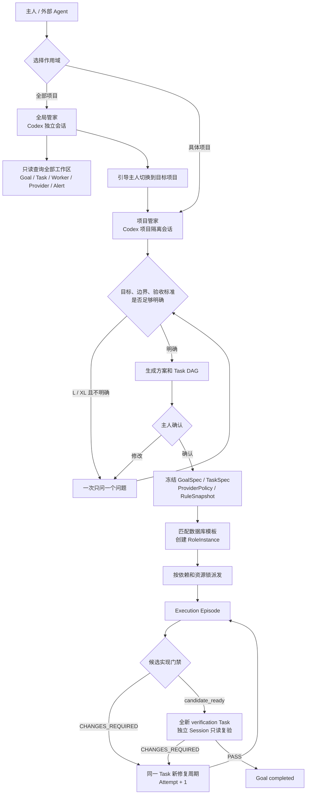
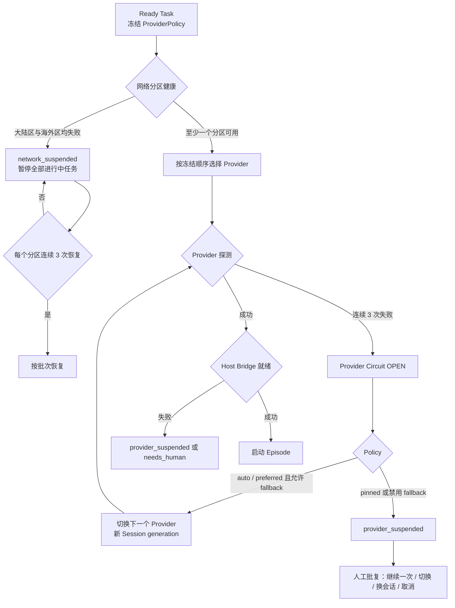
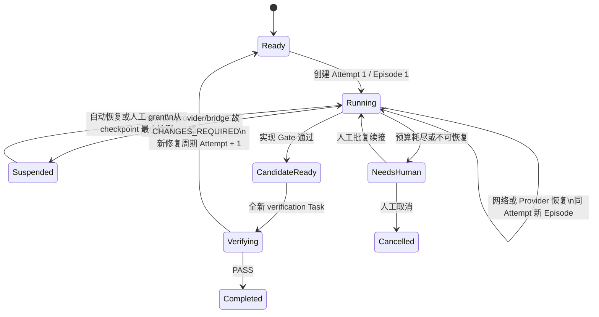
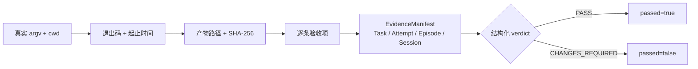
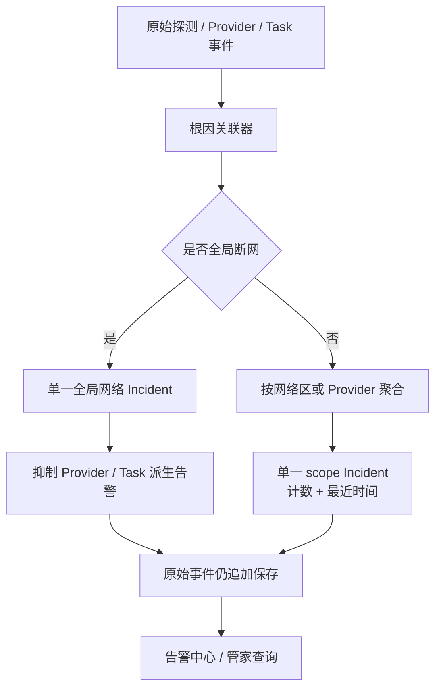
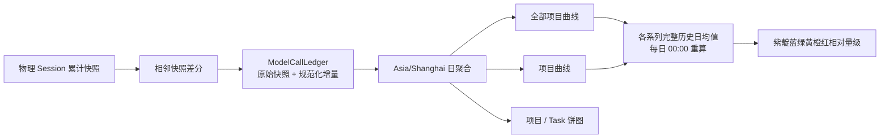

# Plow Whip Web V2 系统流转

本文描述当前实现的统一主链。状态、续接、验证和告警必须落在这条链上，不为单个故障增加旁路状态机。

## 1. 从指令到完成

- 全局管家不替项目执行；项目之间的会话、规则和工作区隔离。
- 同一条 intake 对话绑定一个物理管家 Session；确认生成 Goal 后归档，新指令创建新对话。
- `project_id + role_id + task_id` 三者相同才允许复用物理 Worker Session。
- 实现任务只能到 `candidate_ready`；只有全新独立验证任务的结构化 `PASS` 可以完成 Goal。

## 2. 调度、网络和 Provider

- 大陆网络区：DeepSeek、Kimi；海外网络区：Codex、Cursor。
- 每区使用 DNS 与两个端点交叉探测；两个区都失败才认定全局断网。
- 断网、Provider、Host Bridge 和 watchdog 故障属于基础设施状态，不写成业务 `CHANGES_REQUIRED`。

## 3. Attempt、Episode、断点续接与 Watchdog

续接只加载不可变 TaskSpec/规则/Provider 策略、最新结构化 checkpoint、当前工作区和已验证 Artifact 的路径/哈希/revision、针对断点的最小检测及下一个动作。不会重放旧聊天、完整日志或完整终端输出，也不会因 `run_id` 改变要求无意义改写文件。

Watchdog 按 `人类 Task+角色约定 > 项目设置 > 全局设置` 解析有效阈值并记录来源。Episode wall、checkpoint、无进展、进展续期和最大 Host 进程共同受 Task hard deadline 约束；heartbeat 或输出字节本身不算进展。

## 4. 证据与终态

空 command、泛化 exit code、模型声明、heartbeat、queued、accepted 或 `wake_accepted` 均不能证明完成。EvidenceManifest 追加写入；更正通过 `supersedes` 关联旧记录。`CHANGES_REQUIRED` 不能生成 `passed=true`。

## 5. 告警收敛

告警使用 debounce、失败滞后和恢复滞后；重复事件只增加 occurrence count，不制造告警风暴。

## 6. Token 账本与界面

`cached_input_tokens` 是 `input_tokens` 的子集；Total 为 Input + Output，不重复相加 Cached。动态颜色只与各系列自己的完整历史日均值比较，当前未结束的上海自然日不进入基线。
