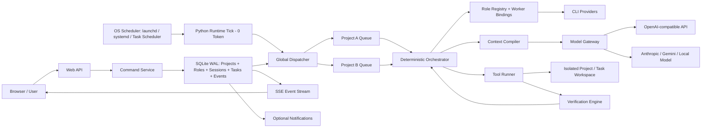

# plow-whip Web v2 产品与架构设计

> Sprint 7 架构修订（2026-07-17）：运行基线改为 Docker-first。Python、Web、SQLite 和单一全局 Cron engine 均位于容器；SQLite/日志使用 `/data` named volume，项目使用 `/projects` named volume。本文中宿主 OS scheduler、系统权限申请与 launchd/systemd/Task Scheduler 安装设计已废止，以 `ARCHITECTURE.md`、`RUNBOOK.md` 和 `SPRINT_7_EVIDENCE.md` 为准。

> 状态：重写基线草案
> 日期：2026-07-16
> 核心方向：不依赖 Codex、Cursor、OpenClaw 或任何现成 Agent Runtime。plow-whip 自己提供 Web 控制面、状态机、上下文编译、模型调用、工具执行、验证和停止条件。

## 1. 一句话定义

plow-whip Web v2 的目标是：保障质量的前提下实现无人值守完成，尽量减少 Token 消费。它面向个人和小团队；用户只提交目标、验收条件和预算，系统用最短必要流程调用模型和工具，持续展示可验证进展，并在完成、需要人工决策或预算耗尽时确定停止。

它不是“多个 Agent 自由聊天的平台”，也不是 Codex/Cursor/OpenClaw 的外部调度壳。

## 2. 本次重写的决定

### 2.1 核心决定

1. Web 页面是唯一人机控制面。
2. 模型是可替换 Provider，不拥有任务状态。
3. 维持稳定的 `Project → Role → Worker Session` 绑定；CLI 是打工仔提供者，每个 CLI Session 是一个项目打工仔。
4. 默认任务只使用一个执行步骤；规划和审查按风险临时增加。
5. Orchestrator 是唯一可以修改任务状态的组件。
6. 每个模型调用都是一个有预算、有输入摘要、有结构化输出的 Run。
7. 完成由验证器认定，不由模型自报 `done`。
8. 通知失败不影响任务是否完成。
9. 没有新证据时不得再次调用模型。
10. 所有重试、改派和审查共享一个任务级总预算。
11. Project 是一级对象；多个项目可以同时运行，但状态、预算、工作目录和故障必须隔离。
12. Python Runtime 是唯一执行面；Web 只是控制面，不再依赖 Desktop、聊天线程或厂商客户端。
13. 首次启动由后端识别操作系统，经用户明确授权后安装系统级定时唤醒入口。
14. 探测、唤醒、派发和驱动进程启动必须是确定性 0 Token 操作；只有显式 Model Run 才能消耗 Token。
15. 维持协作文件和角色会话的阈值切割轮转；轮转只产生确定性 Carry Forward，不调用模型总结。
16. 整套实例只使用一个高可用系统 Scheduler，扫描所有 Project、Role、CLI、Task、Worker、Session 和 Rotation 状态。

### 2.2 明确不做

- 不绑定 Codex、Cursor、OpenClaw 或其他 Agent 产品。
- 不保留 Desktop Thread、App Server、回调会话或 Desktop 兼容层。
- 不强制 PM、规划官、审核官、执行官等固定官僚链；Role 由项目按真实职责配置。
- 不让不同角色自由聊天、逐层转述或重复读取完整目标；跨 Role 接力只传结构化 Delta。
- 不展示或持久化模型隐藏思维链。
- 不依靠模型主动调用 `progress`、`complete`、`consume` 来维持状态机。
- MVP 不引入 Redis、Kafka、NATS、Postgres、Kubernetes。
- MVP 不做多租户 SaaS、组织 RBAC、插件市场、远程 Agent 集群。
- 不把 Git 发布、通知、审查器做成核心状态机的硬依赖。
- 不用模型判断“是否该唤醒、是否卡死、该派给谁或是否该重试”。

## 我们的原创优秀理念：Web v2 的灵魂

edict 给我们提供的是一种可落地的 Web 控制面和制度化实现参考，但下面这些理念来自 plow-whip 自己，也是新版不能丢失的核心资产。

### 目标驱动，而不是对话驱动

用户给的是 Goal，不是需要长期陪聊的 Prompt。系统必须把 Goal 固化为：

- Objective
- Acceptance Criteria
- Constraints
- Budget
- Stop Condition

聊天只是一种输入方式，不能成为任务真源。Web v2 中，Goal/Task 数据库存储是主角，消息框只是创建和纠正 Goal 的入口。

### 状态比聊天记录更可信

旧 plow-whip 最初最正确的判断是：不同模型、会话和电脑之间不能依赖“你还记得我们聊到哪了吗”。真正能接力的是结构化状态、Artifact 和验证证据。

结合 edict 后：

- 借用它的任务看板、状态流转和审计时间线；
- 不读取多个 Agent 的 Session JSONL 来猜状态；
- Web v2 的 Event Store 是唯一任务历史，模型对话只是 Run Artifact。

### 上下文是编译产物，不是历史回放

plow-whip 的 Context Pack、冷热分层和会话轮转，本质上都指向同一个优秀理念：

> 每次模型调用只拿完成当前动作所需的最小上下文。

Web v2 将它升级为 Context Compiler：从 Goal、当前 Step、Artifact、Evidence 和 Budget 编译 Capsule。模型不读取完整数据库、不读取完整历史，也不读取其他 Run 的原始对话。

### 三层记忆，而不是一个无限会话

| 层 | 内容 | Web v2 实现 |
|---|---|---|
| Hot | 当前 Step、失败证据、预算、必要约束 | Context Capsule，直接进入下一 Run |
| Warm | 当前 Task 的计划、决策、Artifact 摘要 | Task Detail 按需读取 |
| Cold | 全量 Event、模型原始输出、工具日志、历史版本 | Event/Artifact Store，默认不进 Prompt |

这比 edict 把 flow log、progress log 和 Session JSONL 融合成完整活动流更节省 Token。完整历史可以给人审计，但不应该自动喂回模型。

### 增量接力，而不是角色转述

旧 plow-whip 强调 carry-forward 和 delta handoff。新版继续保留。Role 和 CLI Session 可以长期绑定，但 Role 之间的接力只发生在 Task/Run 的结构化状态上，不通过自由对话转述。

每次接力只保留：

- 新 Artifact
- 未通过的验证证据
- 当前未完成 Step
- 用户最新决策
- 剩余预算

不再出现“规划角色复述用户需求、审核角色复述规划、执行角色再复述审核”的 Token 浪费。接收 Role 只读取同一 Task 的最小 Capsule 和新增 Evidence。

### 角色是稳定职责槽位，不是状态真源

旧 plow-whip 把 logical owner、executor、driver 分开，是非常好的抽象。新版保留 Project 内的长期 Role，并把它限制在清晰边界内：

- Role 是稳定职责，例如 `pm/backend/frontend/qa/devops`，由项目自行定义；
- 每个 Role 同时绑定一个 active Worker Session；CLI Provider 负责提供和恢复这个打工仔；
- Worker Session 在同一 Project 内跨 Task 顺序工作，并按阈值轮转；同一个打工仔同时只能执行一个 Task；
- Project 完成、取消或归档后释放全部 Worker Session，不把打工仔跨项目复用；
- `plan/execute/verify/review` 是 Run Type，`coding/research/data/security` 是 Capability；
- Provider/Model/CLI Provider 是执行资源，Role、Session 和模型都不能直接修改 Task 真源；
- 不强制某一套角色，也不因为角色存在就自动增加规划、审查或讨论步骤。

这保留了确定性路由思想，同时删除长期角色的同步成本。

### 规则分层与项目边界

旧 plow-whip 的“全局规则 / 项目规则、继承规则 / 派生规则、项目规则优先”应保留，并在 Web 中成为明确的 Policy Scope：

```text
System Safety Policy
  < Workspace Policy
    < Project Policy
      < Task Constraints
```

每条进入 Capsule 的规则必须有稳定 ID、作用域和触发条件；最多注入当前 Step 真正相关的规则。Web 页面可以查看继承结果，但模型不需要读整本 Handbook。

### 质量门是验证策略，不是固定部门

plow-whip 一直坚持“代码完成不等于任务完成”，这比单纯多 Agent 讨论更重要。edict 用门下省实现制度审核；Web v2 把这个优点改造成风险策略：

- 能机器验证的，优先本地 Verify；
- 普通任务无需模型 Review；
- 高风险任务增加一次独立 Review；
- 发布门可以配置更严格证据；
- Review 失败最多进入一次受预算约束的修复，不允许无限封驳。

我们保留“制度性质量门”，删除“每项任务都必须经过一个审核人格”。

### Token 是一等资源

省 Token 不是缩短一段 Prompt，而是管理整个任务的资源消耗。新版必须把以下数据放进核心模型和 UI：

- 每个 Run 的 input/cached/output Token
- Context Capsule 大小
- 重复上下文避免量
- 本地验证替代的模型调用数
- 重试和 Review 的额外成本
- Task 剩余预算
- 超预算硬停止原因

edict 的 Token 排行和成本展示值得借鉴，但 Web v2 进一步把预算变成调度约束，而不只是事后统计。

### 有界自动化才是真自动化

旧 plow-whip 最重要、也最没有实现好的理念是 bounded unattended execution。新版必须把“有界”定义成硬约束：

- 一个 Task 只有一个全局 Attempt 预算；
- Provider 切换不重置预算；
- Review 和修复也消耗同一预算；
- 没有新 Evidence 不得重试；
- 任何循环必须存在最大次数和终态；
- 自动化的能力包含“知道什么时候停止”。

edict 的重试、升级、回滚机制可以参考其事件记录方式，但不能照搬“失败后唤醒更多角色继续协调”。

### 人始终拥有最高优先级

人可以在 Web 页面随时：

- Pause
- Cancel
- 修改 Goal
- 回答 Decision
- 增加预算
- 接受当前结果
- 从失败证据创建新 Task

人工纠正立即生效，不需要等待 PM、controller 或某个 Agent 会话消费消息。系统保留审计记录，但不能用流程层级阻止人纠偏。

### 完成必须有证据

旧 plow-whip 的 `verify_commands`、候选 SHA 和独立验收思想应完整保留。新版完成条件是：

```text
Artifact 存在
+ Acceptance 可验证
+ Verification 通过
+ 高风险任务的 Review 通过
+ Budget 和权限未越界
= completed
```

模型说“已完成”、进程返回 0、页面收到通知，都不能单独把 Task 标记为完成。

### 控制面与执行面分离

edict 的 Dashboard/Orchestrator/Runtime 分层非常适合承载这个理念。Web v2 中：

- Web 是 Control Plane；
- Orchestrator 是状态权威；
- Model/Tool Runner 是 Execution Plane；
- SSE/通知是 Observation Plane；
- Provider 故障、浏览器关闭和通知失败不能污染任务真相。

### 可携带、可恢复，但不复制完整会话

旧 plow-whip 追求跨会话、跨 CLI、跨电脑恢复，这个方向仍然正确。新版恢复单位不是 Agent Session，而是：

- Task Snapshot
- Event sequence
- Artifact hashes
- 当前 Step
- Remaining Budget
- 最短 Failure Evidence

项目可以导出为 Git 可保存的 snapshot；恢复时创建新 Run，不需要恢复某个厂商 Agent 的完整对话。

### 我们与 edict 结合后的核心公式

```text
plow-whip 的 Goal / Role Binding / Context / Memory / Rotation / Budget / Verification / Boundedness
+ edict 的 Web Dashboard / State Guard / Event Audit / Human Controls / Provider Config
- 固定官僚链 / Role 间自由对话 / 思考流回灌 / 无全局预算的升级循环
= plow-whip Web v2
```

因此，新版不是“比 edict 少几个 Agent”，而是把 edict 的制度化能力从角色身上拿下来，放进确定性软件系统里。

## 3. 对 edict 的借鉴与边界

参考项目：

- [cft0808/edict](https://github.com/cft0808/edict)
- [任务分发流转架构](https://github.com/cft0808/edict/blob/main/docs/task-dispatch-architecture.md)
- [Agent 架构重设计](https://github.com/cft0808/edict/blob/main/edict_agent_architecture.md)

### 3.1 借鉴的部分

| edict 思想 | Web v2 中的对应实现 |
|---|---|
| Web 看板是主要控制面 | plow-whip 自带任务控制台，不再依赖聊天窗口 |
| 状态转换受保护 | 由单一 reducer 校验合法状态转换 |
| 完整流转审计 | 每次状态变更、模型调用、工具调用和人工操作写 Event |
| 可暂停、取消、恢复 | Web 页面直接操作 Task，不通过唤醒某个 Agent |
| 可观测成本 | 每个 Run 显示输入、缓存、输出 Token、成本和预算余量 |
| 事件驱动 | 状态变更产生事件；MVP 使用 SQLite Outbox + SSE |
| 模型可配置 | Provider/Model 是执行资源，可按任务策略选择 |
| 结构化 Todo | Step 是系统对象，不是 Agent 文本中的待办列表 |

### 3.2 不照搬的部分

| edict 机制 | 不照搬原因 |
|---|---|
| 太子→中书→门下→尚书→六部固定流转 | 每个节点都要重新注入上下文并生成 Token，大量任务不需要这些角色 |
| 每个任务强制门下审核 | 低风险任务的审核成本可能高于执行成本 |
| 十二个长期 Agent Workspace | 会制造长期会话、角色同步、权限矩阵和状态恢复负担 |
| Agent 通过 CLI 主动更新看板 | 把不确定模型放入控制协议，容易漏报或错误推进 |
| Session JSONL 融合与思考流展示 | 成本高、噪声大，也不应把隐藏思维链作为产品数据 |
| 停滞→重试→升级更多 Agent→自动回滚 | 各阶段局部有界，但组合后容易变成系统级循环 |
| Redis Streams + Postgres 默认栈 | 对单机个人工具过重，增加部署和恢复故障面 |

结论：借鉴 edict 的“制度化控制面”，不复制它的“官僚化执行链”。

## 4. plow-whip 的省 Token 核心

### 4.1 无角色转述

所有 Role/CLI Run 都直接读取同一份 Context Capsule。长期 Session 只用于在同一 Role 内保持执行连续性，不允许把完整 Session 历史转交给其他 Role，也不存在“规划角色把用户要求复述给审核角色，再由审核角色复述给执行角色”。

### 4.2 Context Capsule

每次模型调用只包含：

```json
{
  "objective": "本轮唯一目标",
  "acceptance": ["可验证完成条件"],
  "constraints": ["最多 8 条当前有效约束"],
  "step": {"id": "S-2", "goal": "当前步骤"},
  "evidence": ["上一轮验证失败的最短证据"],
  "artifacts": ["需要读取的文件或对象引用"],
  "budget": {"remaining_tokens": 12000, "remaining_attempts": 1},
  "output_schema": "本轮结构化返回格式"
}
```

不包含：

- 完整 Task JSON
- 完整事件历史
- 完整协议或 Handbook
- 其他角色的对话
- 原始 CLI Transcript
- 已经成功且与当前步骤无关的工具输出

### 4.3 Delta Handoff

Run 之间只传：

- 新产生的 Artifact 引用
- 验证失败摘要
- 未完成的下一步
- 预算余量
- 用户最新决策

旧内容通过哈希引用，不重复拼入 Prompt。

### 4.4 本地优先

以下操作不调用模型：

- 任务状态转换
- 文件、Git、进程和端口检查
- JSON Schema 校验
- 验证命令执行
- 重试预算计算
- Provider 健康检查
- Context Capsule 去重和裁剪
- 是否需要规划/审查的规则判定

### 4.5 按风险增减步骤

| 模式 | 流程 | 适用情况 |
|---|---|---|
| Economy | Execute → Verify | 明确、小型、可机器验证的任务 |
| Balanced | Plan once → Execute → Verify | 需要拆解但风险可控的任务 |
| Strict | Plan once → Execute → Verify → Independent Review | 发布、安全、资金、生产变更 |

“规划”和“审查”是临时 Run 类型，不是长期 Agent。

### 4.6 硬预算

每个 Task 同时拥有：

- `max_input_tokens`
- `max_output_tokens`
- `max_cost`
- `max_runs`
- `max_attempts`
- `deadline`

任一预算耗尽，立即进入 `needs_human` 或 `terminal_failed`，不得静默继续。

### 4.7 0 Token 控制循环

新版必须把“系统在工作”和“模型正在推理”拆成两类完全不同的动作：

| 操作 | 实现 | Token |
|---|---|---:|
| Probe 探测 | 查 SQLite、PID、锁、心跳、文件、端口、截止时间和 Provider HTTP 健康 | 0 |
| Wake 唤醒 | 系统定时任务启动一次短生命周期 Python Tick | 0 |
| Dispatch 派发 | 按状态、能力标签、预算和并发规则选择 Project/Task/Provider | 0 |
| Drive 驱动启动 | 创建 Attempt、准备工作目录、编译 Capsule、启动 Worker 进程 | 0 |
| Tool/Verify | 本地命令、文件操作和确定性验收 | 0 模型 Token |
| Model Run | 向模型 Provider 发送明确的 Capsule | 按实际调用计费 |

“Drive 0 Token”指驱动器启动和推进状态机不需要询问模型。若任务确实需要模型，必须产生独立的 `model_run.started` 事件；在此事件之前 `input_tokens/output_tokens/cost` 必须全部为 0。

系统定时任务不得发送“你还活着吗”“请继续任务”“判断下一步怎么办”等 Prompt。需要模型规划时，必须创建用户可见、受预算限制的 `Plan Run`，不能伪装成后台探测。

## 5. 总体架构



### 5.1 Web UI

负责项目管理、目标提交、任务观察、预算展示、人工决策、Provider 和系统设置。UI 不直接改变数据库，只提交 Command；浏览器关闭不影响 Python Runtime 继续工作。

### 5.2 Command Service

接收 `create/pause/resume/cancel/approve/retry`，校验当前状态、revision 和用户权限，转换成领域事件。

### 5.3 Orchestrator

纯确定性 reducer：读取当前 Task、最新 Event 和预算，决定下一项系统动作。它不调用模型做流程判断。

### 5.4 Context Compiler

根据 Step 类型、Artifact、失败证据和预算生成最小 Context Capsule。它必须能输出 Token 估算和裁剪原因。

### 5.5 Model Gateway

统一 Provider 差异，支持：

- OpenAI-compatible Chat/Responses API
- Anthropic
- Gemini
- 本地 OpenAI-compatible 模型

Provider 返回的只是 `RunResult`，不能直接修改 Task。

CLI Provider Adapter 负责雇用、启动、恢复、轮转和释放 Worker Session，并捕获 Session ID、解析结构化事件、记录 PID 和终止进程。CLI 可以封装模型调用，但 Adapter 不能绕过 Orchestrator、Execution Lease、Budget 和 Verification。

### 5.6 Tool Runner

运行白名单工具和项目命令。每次执行都有工作目录、超时、输出上限和 Artifact 记录。

### 5.7 Verification Engine

执行确定性验收：测试、lint、文件断言、HTTP 检查、Git diff、Schema 或用户定义脚本。验证结果决定是否完成或生成下一轮最小 Evidence。

### 5.8 SQLite Event Store + Outbox

MVP 使用一个 SQLite 数据库：

- Task 当前投影
- 不可变 Event
- Run/Attempt 记录
- Artifact 元数据
- Budget Usage
- Outbox 通知

SSE 从 Event 表增量推送。未来多机部署时才替换 Postgres/Redis；领域协议保持不变。

### 5.9 多项目并行调度

多项目并行是 MVP 能力，不是后续扩展。Global Dispatcher 对所有 Project 做加权公平轮询，满足条件的不同项目 Task 可以同时运行。

并发受四层限制：

- `global_max_active_attempts`：整台机器的总并发上限；
- `project_max_active_attempts`：单项目并发上限，避免一个项目占满资源；
- `provider_max_concurrency`：遵守 Provider 限流；
- `resource_lock`：同一仓库、worktree、端口或声明的独占资源不得冲突。

隔离边界：

- 每个 Project 有独立根目录、Policy、Provider 偏好、预算池和并发配置；
- 每个 Task 有独立工作目录，例如 `runtime/projects/{project_id}/tasks/{task_id}`；
- 一个项目的熔断、预算耗尽、Provider 故障或坏任务不能暂停其他项目；
- 同一 Task 仍然只能有一个 active Attempt；“项目并行”不等于“同一任务重复执行”；
- 调度器必须防止饥饿，不能永远优先最近产生事件的项目。

### 5.10 操作系统定时任务适配器

首次启动时由 Python 后端通过 `platform.system()` 和能力探测识别真实运行环境，不能相信浏览器 User-Agent：

| 系统 | 首选适配器 | 退路 |
|---|---|---|
| macOS | 用户级 `launchd` LaunchAgent | Web 进程内 Tick，仅开发模式 |
| Linux | `systemd --user` Timer | 用户级 cron |
| Windows | Task Scheduler 用户任务 | Web 进程内 Tick，仅开发模式 |

首次启动向导必须：

1. 显示检测到的系统、Python 绝对路径、数据目录和将安装的任务定义；
2. 先做目录可写、Python 可执行、调度器存在和单实例锁检查；
3. 请求用户明确点击“安装系统定时任务”，不静默提权、不隐藏命令；
4. 安装一次性 Tick 命令，例如 `python -m plow_whip_runtime tick --config <absolute-path>`；
5. 立即执行 Test Tick，并显示退出码、最后运行时间和下一次计划时间；
6. 支持 Repair、Disable、Uninstall，所有变化写入 Audit Event。

系统任务按 plow-whip 实例安装一次，不按 Project 重复安装。启动首个 Project 时若尚未安装，页面发起一次授权；后续 Project 只注册到数据库并复用同一个 Global Tick。这样新增、暂停或删除项目不会在操作系统中制造多套彼此竞争的定时任务。

Tick 是可重复调用且幂等的。它先获取全局调度锁，扫描所有 Project 的到期动作，原子领取一个有界批次，并直接驱动或启动对应 Python Worker；整个过程不依赖 Web 服务存活。批次结束后 Tick 退出，重叠触发由单实例锁拒绝。Web 页面不打开、Web 服务重启或 SSE 断开都不应阻止下一次 Tick。启动时发现系统任务漂移只能提示修复，不能偷偷重装。

### 5.11 彻底移除 Desktop

新版不把 Desktop 当主路径、适配器或兼容目标。浏览器只通过 REST/SSE 连接本地 Python Backend；Python Runtime 直接负责：

- 管理 Worker 子进程、PID、端口和超时；
- 在授权根目录内读写文件并运行白名单命令；
- 安装、测试和维护系统定时任务；
- 直接调用模型 Provider API；
- 持久化状态、Artifact、Evidence、预算和审计事件。

因此不存在 Desktop 回调失败、Thread 是否活跃、App Server 能否消费消息等问题。若 Backend 监听地址不止 loopback，必须启用本地认证和 CSRF/Origin 防护。

### 5.12 Project-Role-Worker 生命周期

准确关系是：

```text
CLI Provider（打工仔提供者）
  → CLI Session（具体打工仔）
    → Project Role（该打工仔在项目中的岗位）
      → Task Queue（在项目生命周期内顺序领取工作）
```

绑定主键是 `(project_id, role_id)`，而不是 Task ID。Project 启动时只以 0 Token 方式给 Role 指定 CLI Provider，不发送“入职 Prompt”来强行创建 Session。该 Role 第一次领取真实 Task、进入显式 Model Run 时，Provider 才创建 CLI Session 并返回 Session ID；这个 Session 随后在同一个 Project 内跨多个 Task 顺序工作。Task 只通过 `active_task_id` 和 Execution Lease 临时占用该打工仔。

绑定状态：

```text
unassigned → hiring → ready → working → ready
                ↓        ↓        ↓
              broken  rotating  replacing → ready
                         ↓
                      released
```

硬约束：

1. 一个 Project Role 同时只有一个 active Worker Session、一个 Session ID 和一个 `generation`；
2. 一个打工仔同时只能持有一个 Task Execution Lease；Role 的 Task Queue 必须串行消费；
3. Task 完成只释放 Task Lease，打工仔回到 `ready`，继续服务同一 Project；
4. Project `completed/cancelled/archived` 时必须释放全部 Worker：终止进程、撤销租约、清除临时 Secret、解除 active binding，并把 Session 引用转入只读 Archive；
5. Project 暂停时 Worker 进入 idle/ready，保留 Session Binding，不继续领取 Task；
6. Project 完成后再次 Reopen 必须创建新 generation 的 Worker，默认不得恢复已经 released 的旧 Session；
7. Task 转交其他 Role 时释放旧 Task Lease，但不解雇两个 Role 各自的 Worker；
8. Session ID、PID、最后事件时间和 Resume 能力由 Python Adapter 捕获，不能依赖模型主动上报；
9. Session 丢失时只能用 Recovery Capsule 雇用 replacement Worker，不能假装恢复原打工仔；
10. Worker 轮转、CLI Provider 切换和 Role Handoff 都不能重置 Task 的 Attempt、Token 或成本预算；
11. 绑定通过 revision/CAS 更新，旧 generation 返回的结果一律作为 stale result 拒绝；
12. Worker Session 是项目劳动力，不是业务真源；数据库中的 Task/Event/Artifact/Evidence 才能决定进度和完成。
13. 为 Role 指定 CLI Provider 是 0 Token 配置操作；创建 Session 必须绑定第一个真实、可计费的 Model Run，禁止用空任务或探活 Prompt 提前烧 Token。

Worker Release Barrier 固定执行：冻结 Project 派发 → 撤销全部 Task/Worker Lease → 对存活进程发送 TERM → 在有界宽限期后发送 KILL → 清除短期 Secret 与临时授权 → Archive Session 引用和最终 Carry Forward → CAS 清空 active Worker Binding。部分 CLI 不支持删除服务端 Session 时，“释放”至少意味着本地永久失效、不可再 Resume、不能领取新 Task。除轮转或不可恢复故障外，Worker 默认一直服务到 Project 终态。

CLI Provider Adapter 统一提供：

```text
probe_installation()
probe_process(pid)
hire(project, role, capsule)
resume_worker(session_id, capsule_delta)
capture_session_id(stream_event)
rotate_worker(session_id, carry_forward)
release_worker(session_id, process_group)
supports_resume()
```

支持新的 CLI 只需实现 Provider Adapter，不把 Codex/Cursor 等厂商语义写入领域状态机。页面显示真实 CLI Provider、岗位、Worker generation 和 Session ID 引用，但产品核心不依赖任何单一 CLI。

### 5.13 文件切割与会话轮转

新版完整保留文件切割轮转，并把它从零散命令提升为 Scheduler 的确定性维护阶段。

默认检查对象：

- `conversations/{role}/current.md`：该 Role 当前会话的 Hot 记录；
- `AGENT_COMMS.md`：按完整消息块切割，禁止从消息中间截断；
- `memory/DECISIONS.md`、`CHANGELOG.md`、`CURRENT_STATUS.md`、`NEXT_ACTION.md`、`ROADMAP.md`；
- CLI Session 的估算 Token、Turn 数、文件字节数和最后活动时间。

默认保留旧版经过验证的基线：Session 软轮转约 3000 Token、硬轮转约 4000 Token、文件安全阈值 16384 bytes、Carry Forward 最多 300 Token；全部可以在 Settings 覆盖。

轮转协议必须原子化：

1. 将 Binding 标记为 `rotating`，禁止领取新 Task；
2. 从 Task 状态、Artifact、Evidence 和近期结构化信号生成确定性 Carry Forward，禁止调用模型总结；
3. 原文件按消息块或完整行切割到只追加 Archive，记录 SHA-256、范围和 archive pointer；
4. 旧 Session ID 写入 Session Archive，旧打工仔状态改为 `released`；
5. CLI Provider 创建 replacement Worker，并以 `generation + 1` CAS 更新 Role Binding；
6. 若原 Task 尚未完成，用同一 Attempt/Budget 和最小 Capsule 继续；
7. 任一步失败保持旧 Archive 可读并进入 `rotation_failed`，不得重复切割同一范围。

Scheduler 只读取文件 stat、行数、块数、估算 Token 和 Session 元数据来判断是否轮转；该扫描和 Carry Forward 均为 0 模型 Token。完整原文留在 Cold Archive，默认不重新注入 Prompt。

### 5.14 单一全局高可用 Scheduler

整套 plow-whip 实例只有一个 OS Scheduler 定义，但每次 Tick 必须扫描以下完整矩阵：

```text
All Projects
  → all configured Roles
    → all CLI Providers, Role Workers and Session IDs
  → all Tasks / Attempts / Workers / Execution Leases
  → all rotation targets / budgets / deadlines / circuit breakers
```

高可用不是同时运行多个无约束 Scheduler，而是“OS 负责反复拉起 + 数据库选主 + 任务幂等”：

- OS 层使用 launchd、systemd user timer 或 Task Scheduler 负责进程崩溃后的下一次拉起；
- Tick 通过 SQLite `SchedulerLease` 获取带 `generation/fencing_token` 的短租约；
- 旧 Scheduler 即使恢复，也不能用过期 fencing token 写状态或启动 Worker；
- 每个派发使用唯一幂等键 `(project, role, task, action, state_revision)`；
- Claim、Event 和 Outbox 在同一事务提交，崩溃后可从未完成 Claim 恢复；
- Scheduler 持续写 heartbeat、扫描游标、开始/结束时间和结果摘要；超时租约可被下一 Tick 接管；
- 单个 Project、Role Worker 或 CLI Provider 的故障只打开局部 Circuit Breaker，不能阻断全局扫描；
- 扫描采用 round-robin 游标和每项目配额，避免目录排序导致固定项目长期饥饿；
- 已授权安装后可按 Settings 执行 definition hash 自检；自动 Repair 必须单独开启，默认只告警。

每轮固定顺序为：`reap workers → verify leases → probe projects/roles/CLI/tasks → enforce rotation → reconcile results → dispatch bounded batch → persist heartbeat`。全过程只有真正启动 CLI Model Run 才消耗 Token。

## 6. 状态机

### 6.1 Project 状态

```text
draft → initializing → active → completing → releasing_workers → completed
                         ↓
                       paused → active
                         ↓
                     cancelling → releasing_workers → cancelled

completed / cancelled → archived
```

Project 只有在全部 Task 达到允许的终态并通过 Worker Release Barrier 后才能进入 `completed/cancelled`。若进程无法终止、租约无法撤销或临时权限无法清理，则停在 `releasing_workers` 或 `release_blocked`，不能伪装完成。

### 6.2 Task 状态

```text
draft
  → ready
  → running
  → verifying
  → reviewing        # 仅 Strict
  → completed

任意非终态：
  → paused
  → needs_human
  → terminal_failed
  → cancelled
```

### 6.3 Attempt 状态

```text
queued → started → succeeded
                 → failed_retryable
                 → failed_terminal
                 → timed_out
                 → cancelled
```

### 6.4 不变量

1. 一个 Task 同时最多一个 active Attempt。
2. `completed/terminal_failed/cancelled` 不可自动离开。
3. `failed_retryable` 不能直接回到 `running`；必须先创建带唯一编号的新 Attempt。
4. 新 Attempt 必须消耗 Task 的 `remaining_attempts`。
5. 没有新 Evidence、用户决策或到期的 `retry_at`，不得创建新 Run。
6. Model Run 成功只表示拿到结构化输出，不表示 Task 完成。
7. Task 完成必须来自 Verification/Review 的确定结果。
8. Web 通知、SSE 断线、浏览器关闭均不改变 Task 状态。
9. 一个 `(Project, Role)` 同时只有一个 active Worker Session generation。
10. 一个 Worker Session 同时只能执行一个 Task；并行需求必须使用不同 Role 实例。
11. Session 轮转、CLI Provider 切换和 Scheduler 接管不得重置 Task 预算或生成重复 Attempt。
12. 只有持有当前 Scheduler fencing token 和 Task Execution Lease 的 Worker 可以提交执行结果。
13. Project 进入 `completed/cancelled/archived` 后，不得存在 active Worker、Worker 进程或有效 Execution Lease。

## 7. 任务处理流程

### 7.1 启动项目

1. 创建 Project、定义 Role，并为每个 Role 选择 CLI Provider；此时不调用模型。
2. Python Backend 检测操作系统和全局 Scheduler；尚未授权安装时只展示安装计划并请求一次授权。
3. Preflight 检查项目目录、CLI 可执行文件、认证引用、Provider 健康、权限、并发和资源冲突。
4. Project 进入 `active` 后由唯一 Global Tick 纳入扫描；不会为项目单独安装第二条 OS 定时任务。
5. Role 没有 Task 时不创建 Session；第一次真实 Model Run 才创建打工仔并捕获 Session ID。
6. 打工仔在项目内持续处理该岗位 Task，Project 终态统一经过 Worker Release Barrier。

### 7.2 创建任务

用户填写：

- 目标
- 验收标准
- 项目目录或数据源
- Economy/Balanced/Strict
- Token/成本/次数预算
- 是否允许写文件、运行命令、访问网络

提交前执行本地 Preflight。缺少权限、目录、Provider 或验证命令时，任务停在 `draft`，不花模型 Token。

### 7.3 运行

1. Orchestrator 创建 Step 和 Attempt。
2. Context Compiler 生成 Capsule，并显示预计 Token。
3. Model Gateway 发起单次结构化调用。
4. Tool Runner 执行获准动作。
5. 结果写 Artifact/Event。
6. Verification Engine 验证。
7. 通过则完成；失败则生成最短 Evidence。
8. 只有策略允许且预算充足时才创建下一 Attempt。

### 7.4 人工介入

只有以下情况进入 `needs_human`：

- 目标或验收条件存在实质歧义
- 需要新增权限或凭据
- 预算即将超限
- 机器验证无法判断两个业务方案
- 高风险操作需要审批
- 全局 Attempt 已耗尽

页面展示一个明确问题和两个至三个动作，不要求用户阅读长日志。

## 8. Web 信息架构

### 8.1 主导航

```text
Today
Projects
Tasks
Templates
Providers
Usage
Audit
Settings / Set
```

不设置“Agent 官员总览”。Provider 和模型只是资源，不是团队成员。

### 8.2 Today 首页

页面目标：10 秒内知道系统是否正常、哪些任务需要人、今天用了多少 Token。

主要区块：

1. New Goal：大输入框 + 项目 + 模式 +预算。
2. Needs You：只显示真正需要人工决策的任务。
3. Running：当前 Step、已用预算、预计下一状态、停止按钮。
4. Recently Completed：结果、验证证据和 Artifact。
5. Usage Strip：今日 Token、成本、缓存命中、节省估算。

### 8.3 Task Detail

顶部：

- Task 状态
- 当前 Step
- 模式
- 预算使用率
- Pause / Cancel

中间主区：

- Objective 与 Acceptance
- Pipeline：Plan（可选）→ Execute → Verify → Review（可选）
- 当前动作与实时 Tool Event
- Artifact/Diff/测试结果

右侧 Decision Panel：

- 只在 `needs_human` 出现
- 解释为什么系统不能自行决定
- 显示继续后的预算影响
- 提供明确选项

底部：

- Audit Timeline
- 默认只显示状态、工具、验证、人工操作
- “高级”模式才显示裁剪后的模型输入/输出
- 不展示隐藏思维链

### 8.4 Usage 页面

展示：

- 按任务、Provider、Model、Run Type 的 Token/成本
- Context Capsule 大小
- 重复上下文避免量
- 本地验证节省的模型调用数
- 失败重试浪费
- 预算终止次数

Token 优化必须成为产品可见指标，而不是 README 宣言。

### 8.5 Providers 页面

- Provider Endpoint
- Model
- API Key 引用（加密存储，不回显）
- 上下文窗口与价格
- 健康检查
- 可用于 Plan/Execute/Review 的能力标签

用户配置的是模型能力，不是 Agent 人格。

### 8.6 Projects 页面

Projects 是多项目并行的总控制台，默认显示：

- 项目状态、正在运行的 Task 数和等待队列；
- 项目 Token/成本预算与今日使用量；
- 当前占用的 Worker、Provider 和独占资源；
- 最近一次 Tick、最后进展时间和明确的阻塞原因；
- Pause Project / Resume Project / New Goal；
- 项目根目录、默认模式、并发上限和 Policy 入口；
- Role 列表、每个岗位的 CLI Provider、Worker Session ID 引用、generation、当前 Task 和 Hire/Resume/Rotate/Replace/Release 状态；
- Scheduler 最近一次扫描该项目、Role、CLI 和 Task 的结果。

页面必须让用户一眼分辨“项目正在并行推进”“等待机器资源”“需要人工决策”和“已经停止”，不能用统一的 Running 掩盖不同状态。

### 8.7 Settings / Set 页面

Set 页面管理绝大多数运行细节，但配置修改仍受 Schema 校验、revision 冲突保护和审计约束。建议按以下标签组织：

| 标签 | 可管理内容 |
|---|---|
| General | 语言、主题、数据目录、开机行为、日志保留时间 |
| Runtime | Python 路径、Worker 总数、进程/命令超时、输出上限、临时目录 |
| Projects | 默认项目目录、全局/项目并发、默认模式、预算模板、资源锁 |
| Workforce & CLI | 项目角色、CLI Provider、Worker Session、岗位绑定、Hire/Resume/Rotate/Replace/Release |
| Providers | Endpoint、Model、Secret 引用、价格、能力标签、限流、Fallback |
| Scheduler | OS 检测、Tick、选主租约、fencing generation、heartbeat、扫描游标、Last/Next Tick、Test/Repair/Disable/Uninstall |
| Rotation | Session/文件软硬阈值、Carry Forward 上限、Archive 保留、失败恢复 |
| Token & Context | Capsule 上限、规则注入上限、缓存、Task/Project/日预算、超限行为 |
| Automation | Attempt、传输重试、Schema 修复、Review 轮次、deadline、人工门策略 |
| Tools & Permissions | 允许根目录、命令白名单、网络策略、Secret 注入和高风险审批 |
| Notifications | 完成、失败、需人工处理通知及静默时段；通知不参与任务状态 |
| Storage & Audit | 备份、导入导出、Artifact 保留、数据库诊断、Audit 导出 |
| Health | Backend、数据库、Worker、Provider、Scheduler 状态和一键诊断包 |
| Advanced / Danger | 原始配置、恢复默认、数据库维护；必须二次确认 |

普通设置保存前展示校验结果。会影响系统的设置必须先显示变更计划和影响范围，再要求明确确认，例如修改 Python、并发、目录、权限、Scheduler 或删除数据。Secret 永不回显；导出的配置只保留 Secret 引用。

## 9. 数据模型

### Project

```text
id, name, root_path, status, default_mode, policy_ref,
budget_id, max_active_attempts, provider_policy_json,
revision, created_at, updated_at, completed_at, workers_released_at
```

### Role

```text
id, project_id, name, responsibility, capabilities_json, cli_provider_id,
enabled, revision, created_at, updated_at
```

### CliProvider

```text
id, kind, executable_ref, auth_profile_ref, capabilities_json,
max_concurrency, health_status, circuit_state, enabled
```

### RoleWorker

```text
id, project_id, role_id, cli_provider_id, session_id,
generation, lifecycle_status, active_task_id, worker_pid, resume_supported,
estimated_tokens, turn_count, last_event_at, revision
```

对未释放记录执行 `UNIQUE(project_id, role_id)`；同一岗位只能有一个 active 打工仔。

### SessionArchive

```text
id, role_worker_id, session_id, generation, reason,
carry_forward_ref, transcript_ref, sha256,
started_at, released_at
```

### Task

```text
id, title, objective, acceptance_json, mode, status,
project_id, assigned_role_id, budget_id, current_step_id, active_attempt_id,
revision, created_at, updated_at, completed_at
```

### Step

```text
id, task_id, role_id, type(plan|execute|verify|review), ordinal,
status, objective, input_artifact_refs, output_artifact_refs
```

### Attempt

```text
id, task_id, step_id, attempt_no, status,
provider_id, model, context_hash, started_at, finished_at,
failure_class, retry_at
```

### Run

```text
id, attempt_id, role_worker_id, session_generation,
kind(model|tool|verify), status,
input_tokens, cached_tokens, output_tokens, cost,
input_ref, output_ref, error_summary
```

### Event

```text
id, scope_type(global|project|task), scope_id, sequence,
type, actor_type, actor_id,
payload_json, created_at
```

`UNIQUE(scope_type, scope_id, sequence)`，客户端以作用域内的 sequence 增量恢复，不依赖随机回执去重。控制循环至少记录 `probe.completed`、`wake.enqueued`、`dispatch.completed`、`worker.started` 和 `model_run.started`；前四类事件的模型 Token 与模型成本必须为 0。

### Artifact

```text
id, task_id, kind, uri, sha256, bytes, mime_type,
created_by_run_id, created_at
```

### Decision

```text
id, task_id, question, options_json, status,
selected_option, decided_at
```

### Setting

```text
scope(global|project), scope_id, key, value_json,
schema_version, revision, updated_at, updated_by
```

### SchedulerInstallation

```text
id, os_type, adapter, command_json, status,
last_tick_at, next_tick_at, last_exit_code, definition_hash,
installed_at, updated_at
```

### SchedulerLease

```text
instance_id, generation, fencing_token_hash, owner_pid,
heartbeat_at, expires_at, scan_cursor_json
```

### SchedulerRun

```text
id, generation, started_at, finished_at, status,
projects_scanned, roles_scanned, cli_providers_scanned, workers_scanned,
tasks_scanned, rotations_completed, dispatches_started, summary_json
```

### RotationRecord

```text
id, project_id, role_id, target_type, target_ref,
source_sha256, archive_ref, carry_forward_ref,
status, created_at, completed_at
```

### ResourceLock

```text
resource_type, resource_key, project_id, task_id, attempt_id,
acquired_at, expires_at
```

## 10. 失败分类和重试

| 失败类型 | 默认行为 |
|---|---|
| Provider 临时错误 | 同一 Attempt 内最多一次传输级重试，不重新生成上下文 |
| 模型输出 Schema 错误 | 一次最短修复请求；仍失败则消耗新 Attempt |
| 工具命令失败 | 写 Evidence；策略允许才新建 Attempt |
| 验证失败 | 将失败摘要交给下一 Attempt，不传完整日志 |
| 权限/凭据缺失 | `needs_human`，不自动重试 |
| 目标歧义 | `needs_human`，不调用更多模型讨论 |
| 超时 | 终止进程；根据全局预算决定一次重试或终止 |
| 预算耗尽 | `terminal_failed` 或用户手工增加预算 |

全局默认：

```text
max_attempts = 2
max_schema_repairs_per_run = 1
max_transport_retries = 1
max_review_rounds = 1
```

这些数字都属于 Task 预算，不因更换 Provider/Model 而重置。

## 11. 安全边界

### 模型能做

- 返回结构化计划或执行建议
- 请求读取允许的 Artifact
- 请求执行允许列表中的工具
- 生成文件补丁或结构化结果

### 模型不能做

- 直接写 Task/Event/Attempt 数据库
- 提高预算
- 修改自身权限
- 创建未声明的新 Run
- 认定 Task 完成
- 绕过 Verification
- 读取其他项目上下文
- 自动添加新的 Provider 或 Secret

### Tool Runner

- 项目根目录白名单
- 命令白名单或审批策略
- 独立工作目录
- 超时和输出字节上限
- 网络默认关闭，可按 Task 开启
- Secret 只以短期环境变量注入

## 12. API 草案

```text
POST   /api/projects
GET    /api/projects
GET    /api/projects/{id}
POST   /api/projects/{id}/pause
POST   /api/projects/{id}/resume
POST   /api/projects/{id}/complete
POST   /api/projects/{id}/cancel
POST   /api/projects/{id}/archive
GET    /api/projects/{id}/roles
POST   /api/projects/{id}/roles
PATCH  /api/projects/{id}/roles/{role_id}
GET    /api/projects/{id}/roles/{role_id}/worker
POST   /api/projects/{id}/roles/{role_id}/worker/hire
POST   /api/projects/{id}/roles/{role_id}/worker/resume
POST   /api/projects/{id}/roles/{role_id}/worker/rotate
POST   /api/projects/{id}/roles/{role_id}/worker/replace
POST   /api/projects/{id}/roles/{role_id}/worker/release
POST   /api/tasks
GET    /api/tasks
GET    /api/tasks/{id}
POST   /api/tasks/{id}/pause
POST   /api/tasks/{id}/resume
POST   /api/tasks/{id}/cancel
POST   /api/tasks/{id}/decisions/{decision_id}
POST   /api/tasks/{id}/retry
GET    /api/tasks/{id}/events?after={sequence}
GET    /api/tasks/{id}/stream
GET    /api/usage
GET    /api/providers
POST   /api/providers
POST   /api/providers/{id}/probe
GET    /api/settings
PATCH  /api/settings
GET    /api/system/capabilities
GET    /api/system/scheduler
GET    /api/system/scheduler/runs
POST   /api/system/scheduler/plan
POST   /api/system/scheduler/install
POST   /api/system/scheduler/test
POST   /api/system/scheduler/repair
POST   /api/system/scheduler/disable
DELETE /api/system/scheduler
GET    /api/rotations
POST   /api/rotations/{id}/retry
```

所有改变状态的 API 必须携带 `expected_revision`，避免浏览器重复点击或旧页面覆盖新状态。

## 13. MVP 技术选型

| 层 | MVP 选择 | 原因 |
|---|---|---|
| Frontend | React + TypeScript + Vite | 看板交互足够，部署简单 |
| Backend | FastAPI | Schema、SSE、异步任务和 API 清晰 |
| Database | SQLite WAL | 单机可靠、事务完整、无需运维 |
| Realtime | SSE | 服务端单向事件推送足够，比 WebSocket 简单 |
| Worker | Python 有界 Worker Pool + 每项目队列 | 支持多项目并行，同时保留全局并发和资源锁 |
| Scheduler | OS Timer + SQLite leader lease/fencing | 浏览器关闭后仍能 0 Token 扫描，并防止重叠 Tick 重复派发 |
| CLI Workforce | 可插拔 CLI Provider Adapter | 每个 Session 是绑定项目岗位的打工仔，项目结束统一释放 |
| Model | Provider adapters | 不绑定任何 Agent Runtime |
| Validation | subprocess + typed policies | 本地、确定、可审计 |
| Packaging | Docker Compose 可选；本机一键启动优先 | 不要求用户先维护基础设施 |

## 14. 实施顺序

### M0：冻结旧系统

- 旧版仅作为需求、失败样本和兼容数据来源。
- 新版不复用 supervisor/controller/receipt/lease 状态机。

### M1：单任务最小闭环

- Web 创建 Task
- 一个 Provider
- 一个 Execute Run
- 一个 Verify
- 完成/失败明确停止

### M2：多项目与 0 Token Runtime

- Project 一级对象和 Projects 页面
- Global Dispatcher、公平队列和有界 Worker Pool
- 项目/Task 工作目录隔离
- resource lock 和全局/项目/Provider 并发限制
- Probe/Wake/Dispatch/Drive 的 0 Token Event 与计量
- 无 Desktop、Thread、App Server 运行依赖
- Project-Role-Worker 稳定绑定和 CLI Provider Adapter 协议
- 同 Worker Session 单 Task Execution Lease
- Project 终态的全 Worker Release Barrier

### M3：系统调度与 Settings

- 完整 Settings / Set 页面和配置 Schema
- OS 能力探测与首次启动向导
- launchd/systemd user timer/Task Scheduler 安装、测试、修复和卸载
- 浏览器关闭后的跨项目 Tick
- Scheduler leader lease、fencing、heartbeat、幂等派发和崩溃接管
- 全项目/Role/CLI/Task/Rotation 扫描矩阵

### M4：Context Capsule 与预算

- Capsule 编译与 Token 预估
- Budget 硬停止
- Delta Evidence
- Usage 页面
- 文件切割、Session 轮转、Cold Archive 和确定性 Carry Forward

### M5：人工控制

- pause/resume/cancel
- needs_human Decision Panel
- revision 冲突保护

### M6：可靠恢复

- 进程崩溃恢复
- SQLite Outbox
- SSE 断线续传
- task-level Attempt 上限

### M7：项目工具

- 文件 Artifact
- Git diff/worktree 适配器
- 验证命令
- Provider/Tool 权限策略

### M8：可选高级流程

- Balanced 一次规划
- Strict 一次独立 Review
- 通知适配器
- 远程 Worker/多机队列（单机多项目稳定后再评估）

## 15. 验收标准

新版进入可用状态前必须证明：

1. 任务完成后不会再次产生 Run。
2. Worker 正常退出但没有有效结果时，最多按全局预算重试，不会无限恢复。
3. 浏览器关闭、SSE 断开和通知失败不影响任务真相。
4. 同一 Task 不会同时出现两个 active Attempt。
5. Provider 切换不重置 Attempt 预算。
6. `completed` 状态不可被后台扫描重新激活。
7. 权限、凭据和目录错误在模型调用前被发现。
8. 验证失败只向下一 Run 注入最小 Evidence。
9. 页面可展示整个 Task 的真实 Token，而非只展示启动 Prompt。
10. Economy 模式的典型任务只发生一次模型调用。
11. 故障测试覆盖崩溃、超时、重复请求、数据库锁、旧 revision、Provider 断网和验证失败。
12. 经过连续 100 个故障注入任务后，零重复执行、零越过终态、零无限循环。
13. 至少两个不同 Project 可以真实并行运行，且一个项目失败、暂停或预算耗尽不阻塞另一个项目。
14. 同一仓库、worktree、端口等冲突资源在并行运行时不会被重复占用。
15. 浏览器和 Web UI 关闭后，系统定时任务仍能完成 Probe、Wake、Dispatch 和 Drive 启动。
16. Probe/Wake/Dispatch/Drive 启动路径产生 0 模型 Token；每次 Token 消耗都能追溯到明确的 `model_run.started`。
17. macOS、Linux、Windows 的调度安装都必须先展示计划并请求授权，且可测试、修复和卸载。
18. Settings 中的系统级变更有 Schema 校验、revision 防冲突、影响预览和 Audit Event。
19. 运行时不依赖 Desktop Thread/App Server；Codex、Cursor 等 CLI 只能作为用户显式配置的可选 Provider Adapter，领域状态机不得写入其厂商专属语义。
20. 重启 Web、Python Runtime 或操作系统后，`Project-Role-Worker Session ID` 绑定仍可恢复，且不会串到其他项目或 Role。
21. 同一 Worker Session 不会同时领取两个 Task；不同项目和不同 Role 仍可并行。
22. Session 轮转后 successor generation 正确接管，旧 Session 的迟到结果被拒绝，Task Attempt 和预算不重置。
23. 文件轮转按完整消息块/行切割，Archive 可校验、Current 可继续、同一 source hash 不会重复归档。
24. 单次 Tick 能覆盖所有项目、Role、CLI、Task 和 Rotation 状态，并记录扫描计数与游标。
25. Scheduler 在持有租约时崩溃，下一 Tick 能在租约过期后接管；故障注入后不出现双 Worker 或重复 Model Run。
26. 单个 CLI、Role 或 Project 熔断时，其余项目仍被扫描和调度。
27. Scheduler 探测 Session 只读 PID、Session 元数据、时间戳、文件增量、租约和状态，不发送模型探活 Prompt。
28. Project 完成、取消或归档时，所有 Worker 都被释放；不存在残留进程、有效租约、临时 Secret 或可继续 Resume 的 active binding。
29. Project 内连续 Task 默认复用该 Role 的同一 Worker Session；Task 完成不会错误解雇项目打工仔。

## 16. 产品判断

edict 证明了 Web 看板、状态机、审计和人工干预是正确产品方向；它也证明固定官僚链条会天然增加模型调用和上下文转述。

plow-whip Web v2 的差异不应是“更少的官员”，而应该是：

> CLI 是打工仔提供者，Session 是项目打工仔，Role 是岗位。打工仔稳定服务到项目完成，但 Task/Event/Evidence 始终是系统真源。

这也是新版最重要的产品边界。

## 17. 双方缺点与新版规避规则

### 17.1 旧 plow-whip 的缺点

#### 理念执行偏差

- 提出了“状态真源”，实际又把 Task、Workflow、Execution、Session、Receipt、Inbox、Git 和聊天回调都变成局部真源。
- 提出了“省 Token”，实际主要约束启动包，没有约束完整 Task 的模型调用次数、会话历史和重试成本。
- 提出了“有界自动化”，但只给每个局部循环设上限，没有 Task 级统一终止预算。
- 提出了“确定性路由”，却仍要求模型主动调用 progress/complete/consume 维持控制协议。
- 提出了“人优先”，但 controller 绑定、回执消费和角色路由延迟了人的直接纠正。

#### 架构缺点

- 严重依赖 Codex/Cursor CLI、Desktop Thread、App Server 和各自会话语义。
- Orchestrator、Worker、Controller、Scheduler、Receipt、Lease、Git Delivery 同时参与任务生命周期，职责交叉。
- 状态枚举和恢复路径过多，同一个任务可能同时表现为完成、运行、阻塞和等待回执。
- Worker 进程退出、模型任务结果、Task 状态、Git 结果之间没有一个权威完成判定器。
- 失败后 Task 仍保持 active，scheduler 可以在控制器处理失败之前再次派发。
- 重试预算按 Driver 计算，切换 Driver、Session 或 Controller 会产生新的循环空间。
- controller receipt 既承担通知又参与收口，通知链路故障会污染业务状态。
- Git、权限、Sandbox 和发布错误被混入 `blocked_waiting_human`，错误分类失真。
- 在 plow-whip 自身上自举开发，导致源码、安装版本、scheduler 版本和 worktree 版本漂移。
- 安全加固、跨平台绑定、HMAC、Lease、Worktree 等机制在基础闭环稳定前过早进入主路径。

#### 产品缺点

- 主要交互依赖 CLI 和聊天窗口，用户无法在一个页面看到 Goal、预算、证据和真正阻塞点。
- “当前是谁的轮次”比“任务离验收还差什么”更突出。
- 日志很多，但缺少面向人的单一结论。
- 任务成本不可预估，也没有全局 Token 硬停止。
- 单元测试覆盖局部函数，却没有验证真实无人值守闭环不会重复执行。

### 17.2 edict 的缺点

以下部分分为仓库明确公开的机制，以及由这些机制带来的架构风险；不能把所有风险都表述为已经发生的线上故障。

#### 固定官僚链条天然耗 Token

- 普通任务也要经过太子、中书、门下、尚书和执行部门。
- 每个角色都需要重新理解目标、读取前序结果并输出新的转述。
- 门下审议是每个任务强制步骤，封驳最多多轮，简单任务也要支付质量流程成本。
- 固定角色让“组织隐喻”高于任务实际需要，不同行业任务很难自然映射到六部。

#### Agent 仍在控制协议内

- Agent 通过 `kanban_update.py` 主动上报 progress、state 和 done。
- 看板正确性仍依赖模型记得调用命令、传对 Task ID、使用合法状态。
- “模型说已完成”和“系统验证已完成”之间没有彻底分离。
- 状态机虽然能拒绝非法跳转，却不能保证 Agent 一定上报真实、完整、及时的状态。

#### 恢复链可能扩大故障

- 停滞处理包含重试、升级门下、升级尚书、自动回滚、重新派发。
- 每个阶段单独有界，但完整链路会继续唤醒更多模型和重复上下文。
- 自动回滚后重置 retry/escalation 计数，如果外层没有 Task 级预算，仍可能再次走完整链路。
- Repo README 本身提供了“下属已完成但无法传回太子，最终超时”的排障说明，说明完成回传仍依赖 Agent/Gateway 链路。

#### 运行时依赖和版本面较大

- 完整运行依赖 OpenClaw、Gateway、多个 Agent Workspace、SOUL 配置、API Key 同步和会话可见性。
- OpenClaw 的 Session、Gateway、Agent ID 或认证变化会直接影响 edict。
- 安装过程需要把 API Key 同步到所有 Agent Workspace，扩大 Secret 管理面。
- README 同时描述 stdlib `server.py`、React 前端、Redis EventBus、SQLAlchemy/Postgres 风格异步后端，存在旧实现与新实现并行的认知和维护成本。
- 15 秒文件同步、Redis EventBus、Outbox 和 Session JSONL 融合可能形成多条数据路径。

#### “完全可观测”可能变成高噪声

- flow log、progress log、Todo snapshot、Session JSONL、thinking、tool result 全部融合，会快速膨胀任务活动流。
- 展示完整 thinking 不应成为产品承诺；它有隐私、安全、可解释性误导和上下文回灌风险。
- 用户真正需要的是动作、证据、差异、失败原因和下一决策，不是几十条角色思考记录。

#### 产品范围过宽

- 看板、模型配置、Skills、新闻、上朝仪式、朝堂讨论、官员统计同时存在，核心任务闭环容易被功能全景稀释。
- 帝国隐喻具有传播力，但会提高新用户学习门槛，也可能掩盖任务、Attempt、Provider、验证等真实工程概念。
- “一键安装、低部署难度”的产品表达与 OpenClaw、多 Workspace、Gateway、Redis/Postgres 路线存在张力。

### 17.3 共同缺点

- 都曾把“增加角色、恢复层和审计层”误认为可靠性会自然提高。
- 都让模型承担了部分状态上报责任。
- 都存在局部重试有界、全局成本不一定有界的风险。
- 都容易把可观测性做成日志堆积，而不是明确结论。
- 都先考虑多 Agent 协作，再考虑单任务最小可靠闭环。
- 都可能把厂商 Runtime 的会话状态误当成业务 Task 状态。

### 17.4 新版硬性规避规则

1. 允许 Project-Role-Worker 在项目生命周期内长期绑定，但禁止 Agent-to-Agent 自由消息成为控制协议。
2. 模型不能写 Task 状态，也不能宣布完成。
3. 一个 Task 只有一个状态投影和一条有序 Event 流。
4. 所有 Run、Review、修复和 Provider 切换共享 Task 总预算。
5. 没有新 Evidence、人工决策或到期 retry_at，不得再次调用模型。
6. 通知、SSE、浏览器和 Provider 会话都不是完成条件。
7. 默认只显示动作与证据，不展示隐藏思维链。
8. Economy 单任务闭环通过之前，不实现 DAG、强制 Review 链或远程集群；Project-Role Worker 可以存在，但一个 Worker 一次只能执行一个 Task。
9. 每项高级机制必须证明减少了失败或 Token，否则不进入主路径。
10. 产品验收以“100 个故障注入任务零重复执行、零越过终态、零无限循环”为底线。
11. 多项目可以并行，但同一 Task 不能并行 Attempt，冲突资源必须加锁。
12. Scheduler、Probe、Wake、Dispatch 和 Drive 启动路径禁止调用模型。
13. 操作系统定时任务只能在用户明确授权后安装，且必须可见、可测试、可撤销。
14. Desktop 不进入新版依赖图；Python Runtime 直接承担系统与工具操作。
15. Session ID 只属于 Project Role 的 Worker，不属于 Task 真源；同一打工仔一次只执行一个 Task。
16. 文件和 Session 必须按阈值轮转；Carry Forward 确定性生成且不调用模型。
17. 一个 OS Scheduler 扫描全部项目、Role、CLI、Task 和 Rotation；重叠实例用 lease/fencing 隔离。
18. Scheduler 和 Session 探测不得通过 Prompt 询问模型状态。
19. Project 终态必须经过 Worker Release Barrier；所有 Session 解绑、租约撤销、进程退出后才完成资源收口。
